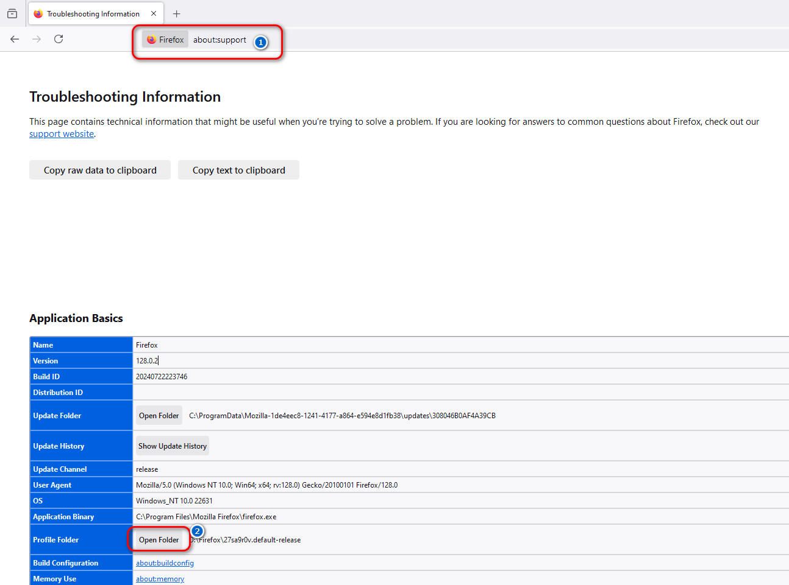
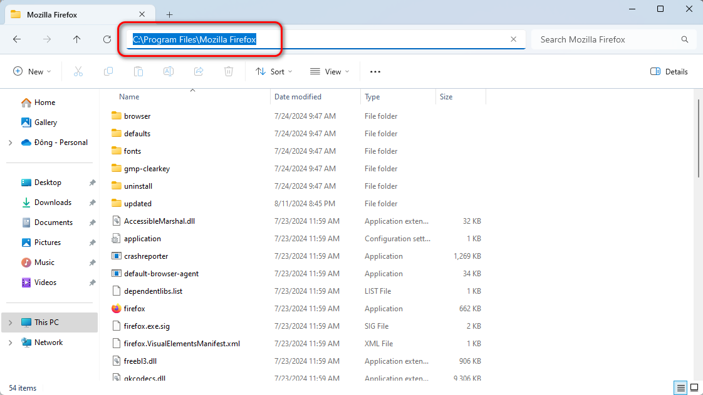
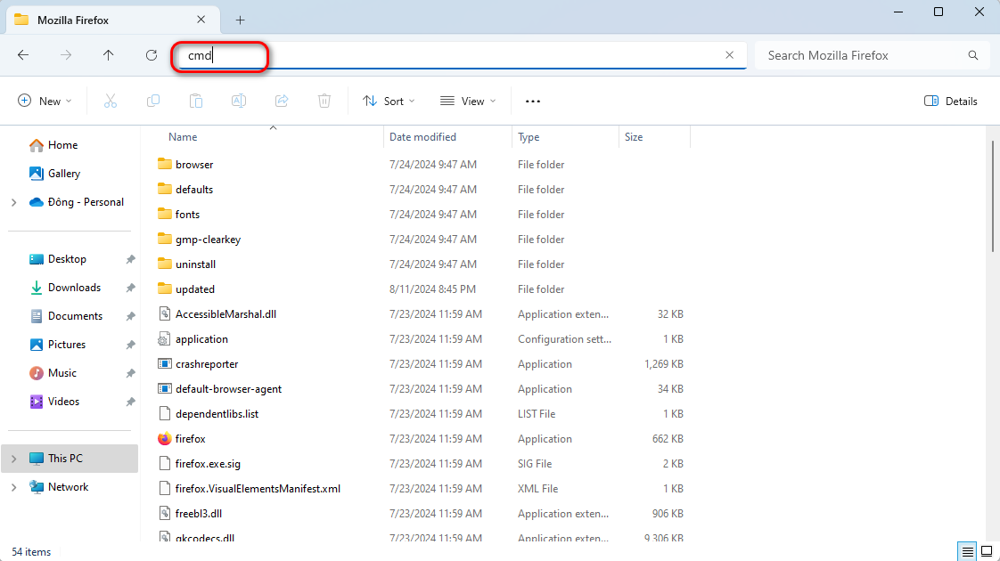
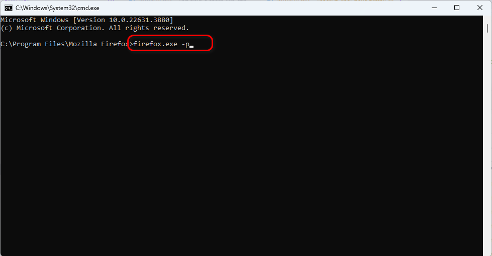
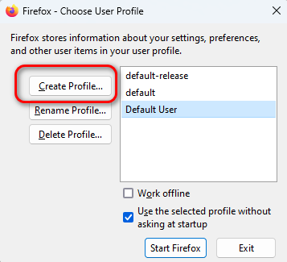
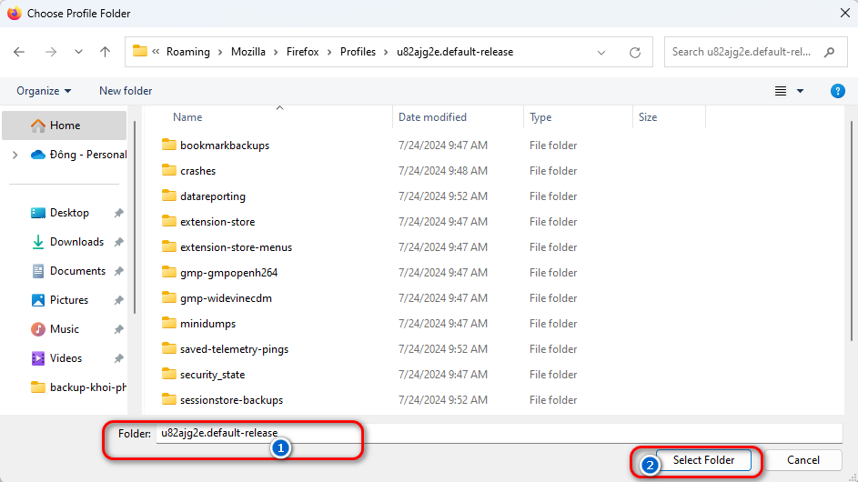
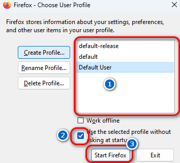

Firefox là một trình duyệt tốt và có nhiều tính năng hay như container, ưu tiên quyền riêng tư, có thể sử dụng Ublock, chụp web, chọn màu tự động,... Nhưng đặc biệt nhất có thể kể đến là tính năng sao lưu và khôi phục Firefox. Nếu bạn chưa đọc bài giới thiệu về Firefox, đọc bài [Firefox có gì hay?](/firefox-co-gi-hay/) để tham khảo thêm các tính năng khác của Firefox.

Đã bao giờ các bạn cài lại hệ điều hành mà mất hết tất cả dữ liệu chưa? Sau khi cài xong hệ điều hành mới, bạn phải đăng nhập lại vào từng trang web trên trình duyệt? Mọi cài đặt của extension đều mất hết và bạn phải cài đặt lại từ đầu?... Đó là một quá trình mệt mỏi và tốn thời gian. Nếu số lượng web càng nhiều thì thời gian để bạn cài mọi thứ cho trình duyệt càng lâu! Nhưng đừng lo, Firefox có giải pháp cho bạn.

Đến với Firefox, bạn sẽ có thể backup lại dữ liệu của mình và khôi phục lại toàn bộ Firefox của bạn mà không bị mất mát gì. Thậm chí, bạn có thể mang Firefox từ nhà bạn lên công ty hay đổi trình duyệt từ Firefox sang Floorp hay Zen Browser mà không bị mất dữ liệu. Mọi dữ liệu trong Firefox đều nằm trong thư mục Profiles. Chúng ta chỉ cần sao lưu thư mục này và đem đến bất kỳ đâu cũng được và Firefox sẽ khôi phục lại như cũ.

## Sao lưu

Đầu tiên, các bạn gõ trên trình duyệt là `about:support`. Sau đó, tìm đến dòng `Profile Folder` và click `Open Folder` để mở thư mục Profile.


Đây chính là thư mục bạn cần backup. Cách backup có rất nhiều cách như:

- Chuyển thư mục này sang ổ Data để không bị mất khi cài lại Win.
- Sử dụng Google Drive, OneDrive hoặc cac dịch vụ lưu trữ nào để backup.
- Sử dụng Git để backup.
  

 Trước khi backup, vui lòng tắt trình duyệt Firefox để tránh `copy` hoặc `move` bị lỗi. 

## Khôi phục

Khi bạn đã có thư mục Profile rồi (nó có thể ở bất kỳ đâu, phụ thuộc vào chỗ bạn đã backup). Bây giờ chúng ta sẽ tìm cách để khôi phục Firefox.

### Truy cập thư mục Firefox

Các bạn vào Files Explorer, sau đó gõ đường dẫn `C:\Program Files\Mozilla Firefox` trên thanh địa chỉ và bấm `Enter` để truy cập như hình.

### Chạy chương trình profiles trên Firefox

Tiếp đến, các bạn gõ chữ `cmd` trên thanh địa chỉ.

Một cửa sổ Console sẽ hiện ra. Các bạn gõ lệnh `firefox.exe -p` vào và bấm `Enter`.

Cửa sổ khác hiện lên. Các bạn chọn `Create Profile`.

Click `Next` và chọn `Choose Folder`. Cửa sổ chọn thư mục hiện lên. Bạn kiếm tới thư mục mà bạn đã backup. Click 2 cái để vào thư mục cần chọn. Cuối cùng, chọn `Select Folder`.

Đặt lại tên Profile nếu muốn, hoặc bạn để mặc định cũng được. Sau đó, nhấn nút `Finish`. Tiếp theo, bạn chọn profile mà bạn mới tạo khi nãy. Nhớ tick vào `Use the selected profile without asking at startup` và chọn `Start Firefox`.

Cuối cùng, bạn đã hoàn thành cách khôi phục lại Firefox. Bây giờ, mọi thứ của bạn được khôi phục như ban đầu.

## Profile hỏng quá nặng

Nếu bạn đã thử thành công bước trên thì sẽ có lúc bạn nghịch profile của bạn và dẫn đến bị lỗi. Khi đó profile của bạn bị hỏng hoàn toàn và chỉ còn cách tạo profile mới.

Tuy nhiên, các bạn có thể giữ lại một số file quan trọng để cứu dữ liệu của bạn.

- `places.sqlite`: lưu bookmark và history.
- `cookies.sqlite`: lưu thông tin đăng nhập.
- `cert9.db`, `key4.db` + `logins.json`: lưu mật khẩu cá nhân.
- `extension-preferences.json` + `extensions.json` + `extension-settings.json` + thư mục `extensions`: lưu thông tin về extensions.
- `search.json.mozlz4`: bộ công cụ tìm kiếm.
- `user.js`: nếu bạn có tạo file user.js thì backup file này lại. Còn không có file user.js thì backup file `prefs.js`.
- Thư mục `chrome` nếu muốn giữ nguyên giao diện.

**Bước 1**: Tắt Firefox.

**Bước 2**: Tạo profiles mới như hướng dẫn ở trên, nhưng không chọn `Select Folder`.

**Bước 3**: Copy các file trong checklist trên vào thư mục profile mới.

**Bước 4**: Nhớ tick vào `Use the selected profile without asking at startup`.

**Bước 5**: Nếu extension không hiện, thì vào tab extension tắt và bật lại các extension lần nữa cho Firefox tự nhận diện lại.

Chúc các bạn thành công.

## Tham khảo

[Tổng hợp những addon chất cho Firefox / Chromium](https://voz.vn/t/tong-hop-nhung-addon-chat-cho-firefox-chromium.682181/)
