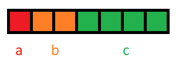

Struct là một phần không thể thiếu ở trong ngôn ngữ C/C++ nó giúp chúng ta tạo ra kiểu dữ liệu mới để dễ dàng quản lý các biến hơn. Tuy nhiên, có một số điều có thể các bạn chưa biết bí thuật về struct của C/C++. Chúng ta cùng tìm hiểu một trong các bí thuật đó là về Bit Fields, và cách áp dụng nó để tạo ra nhiều biến khác nhau với số bit nhất định nhé.

## Giới thiệu

> Bit Fields là cách chia vị trí bộ nhớ liền kề nhau và giữ một chuỗi bit.

Các bạn đã biết, kiểu dữ liệu chiếm vùng nhớ nhỏ nhất trong ngôn ngữ C/C++ luôn luôn chiếm 1 bytes cho dù là kiểu char hay bool.  Mà 1 bytes sẽ gồm 8 bits, 1 bits sẽ có hai thể hiện là 0 hoặc 1. Vậy nếu kiểu char, 1 byte sẽ có $2^8=256$ thể hiện. Vậy giả sử, ta chỉ cần tạo ra 8 biến flags ( kỹ thuật đặt cờ hiệu) và mỗi biến chỉ cần có 2 thể hiện là 0 hoặc 1 (tượng trưng cho việc sai hoặc đúng).

Nếu bình thường, ta cần tạo 8 bits kiểu char hoặc bool để làm việc đó, thì ta sẽ tốn 8 bytes để lưu được 8 biến flags. Điều đó, bạn đã lãng phí hết 64-8=54 bits mà chẳng được gì. Bạn hãy nghĩ xem, chúng ta chỉ cần 1 bits để tạo ra 2 thể hiện thôi. Vậy ta chỉ cần 1 bytes cho 8 biến đó là được, vì 1 bytes có 8 bits.

**Ví dụ:** 1 byte có 8 bits. Thì mình có thể chia ra làm nhiều vùng nhớ bất kỳ: vùng nhớ $a$ chứa 1 bits đầu, vùng nhớ $b$ chứa 3 bits tiếp theo và vùng nhớ $c$ chứa 4 bits cuối cùng.



Mở rộng ra thì bạn không bị giới hạn bởi 1 byte, mà bạn hoàn toàn có thể có kiểu dữ liệu 4 bytes và chia ra các vùng nhớ có 8 bits, 10bits,... cũng được luôn.

1 bytes ở đây bạn có thể hiểu là kiểu char, bool. 4 bytes là int, float,... và mở rộng ra cho các kiểu có size lớn hơn như long, double,...

## Các trường hợp thường áp dụng

- Khi bạn cần code trên phần cứng khá eo hẹp về bộ nhớ.
- Khi bạn cần tách bit ra để làm một yêu cầu nào đó về bit.

## Cách cài đặt

Để làm được điều đó, ta dùng **':'** để trình biên dịch biết là chúng ta chỉ cần dùng bấy nhiêu bit thôi, chứ không muốn dùng hết. Bạn xem ví dụ bên dưới để hiểu rõ hơn.

```cpp
#include <iostream>

using namespace std;

struct t {
  unsigned char x1:1; // Chỉ muốn dùng 1 bits cho biến x1
  unsigned char x2:1; // Chỉ muốn dùng 1 bits cho biến x2
  unsigned char x3:1; // Chỉ muốn dùng 1 bits cho biến x3
  unsigned char x4:1;
  unsigned char x5:1;
  unsigned char x6:1;
  unsigned char xx:2; // Muốn dùng 2 bits cho biến xx
};

int main(){
  struct t a;

  cout << "Size cua struct t la: " << sizeof(a) << " bytes" << endl;

  a.x1 = 0; //Vẫn còn nằm trong range (0,1)
  cout << "Gia tri cua x1 khi a.x1 = 0: "<< (int)a.x1 << endl;

  a.x1 = 1;//Vẫn còn nằm trong range (0,1)
  cout << "Gia tri cua x1 khi a.x1 = 1: "<< (int)a.x1 << endl;

  a.x1 = 2;// Vượt ra khỏi range(0,1)
  cout << "Gia tri cua x1 khi a.x1 = 2: "<< (int)a.x1 << endl;

  a.x2 = 1;
  cout << "Gia tri cua x2 khi a.x2 = 1: "<< (int)a.x2 << endl;

  cout << endl;

  //Thử nghiệm với số bit là 2 bits
  a.xx = 0;
  cout << "Gia tri cua xx khi a.xx = 0: "<< (int)a.xx << endl;

  a.xx = 1;
  cout << "Gia tri cua xx khi a.xx = 1: "<< (int)a.xx << endl;

  a.xx = 2;
  cout << "Gia tri cua xx khi a.xx = 2: "<< (int)a.xx << endl;

  a.xx = 3;
  cout << "Gia tri cua xx khi a.xx = 3: "<< (int)a.xx << endl;

  a.xx = 4;
  cout << "Gia tri cua xx khi a.xx = 4: "<< (int)a.xx << endl;

  return 0;
}

```

**Output:**

```
Size cua struct t la: 1 bytes
Gia tri cua x1 khi a.x1 = 0: 0
Gia tri cua x1 khi a.x1 = 1: 1
Gia tri cua x1 khi a.x1 = 2: 0
Gia tri cua x2 khi a.x2 = 1: 1

Gia tri cua xx khi a.xx = 0: 0
Gia tri cua xx khi a.xx = 1: 1
Gia tri cua xx khi a.xx = 2: 2
Gia tri cua xx khi a.xx = 3: 3
Gia tri cua xx khi a.xx = 4: 0
```

Ở giá trị của biến $a.xx=4$ do nó vượt quá thể hiện của 2 bits (số lượng thể hiện: $2^2=4$ và thể hiện là $=\\lbrace 0,1,2,3 \\rbrace$). Lúc đầu, số 4 ở hệ nhị phân là 100, nhưng ta chỉ lấy 2 bits cho nên dãy bit mà nó lấy là $00$ ở hệ thập phân là $0$ (khác với mảng, bit duyệt từ phải sang trái). Đó là lý do mà khi gán vượt khỏi range của bits thì nó quay về giá trị đầu tiên.

## Tổng kết

Bài viết nêu khái niệm, cách sử dụng bit fields trong lập trình. Và trường hợp nên sử dụng nó, lúc code bài tập thì cũng không cần quá kiêng dè, máy mạnh to thì cứ tạo cho sướng không cần tiết kiệm bộ nhớ, vì mục đích code luyện tay không phải code trên những phần cứng hạn hẹp dung lượng.
