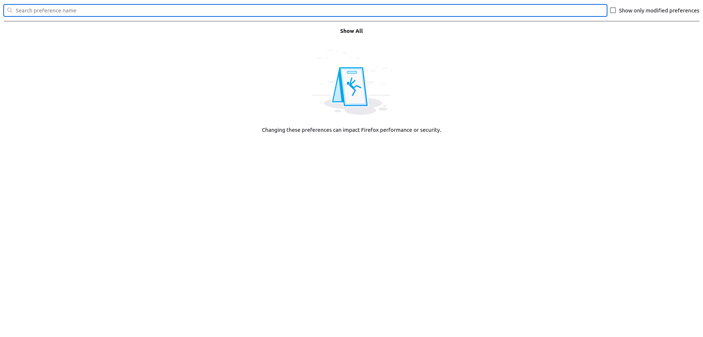
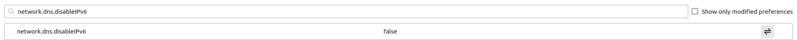
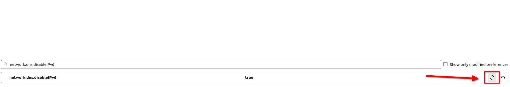
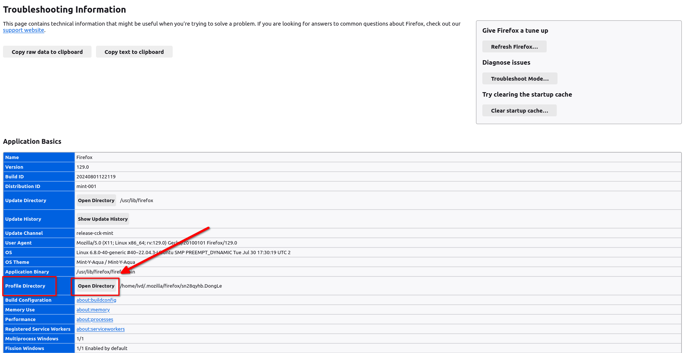
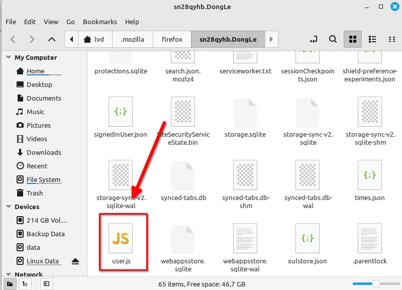
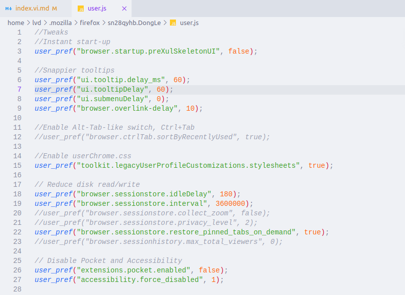

Firefox là một trình duyệt web nâng cao, để sử dụng nó bạn cần tối ưu theo cách của bạn. Nếu bạn cần một trình duyệt chỉ cần cài và dùng? Hãy chọn Chrome. Nếu bạn cần một trình duyệt đáp ứng được nhu cầu công việc, tối ưu hóa cách làm việc, tinh chỉnh cho phù hợp cá nhân thì bạn hãy chọn Firefox.



- Firefox bạn cũng có thể cài và dùng như Chrome và nếu muốn thì bạn thêm tinh chỉnh theo nhu cầu cá nhân. Tức là như Chrome và thêm tinh chỉnh cá nhân.
  

Có hai cách để bạn cài setting cho trình duyệt của mình. Mình khuyến khích dùng [cách 2](./#cách-thay-đổi-bằng-file-khuyến-khích-sử-dụng) để tiện cho việc backup và khôi phục.

## Cách cài đặt Setting cho trình duyệt

### Cách thay đổi trực tiếp trên trình duyệt


Khi bạn thay đổi bằng cách này, trình duyệt của bạn sẽ áp dụng khi bạn khởi động lại trình duyệt. Và những cài đặt này sẽ không thể đồng bộ với Firefox được.

Khi bạn chuyển sang máy khác và bật `Sync` thì những gì bạn cài đặt sẽ mất. Nếu bạn muốn sao lưu và khôi phục tất cả cài đặt thì chuyển sang [Mục 1.2](./#c%c3%a1ch-thay-%c4%91%e1%bb%95i-b%e1%ba%b1ng-file-khuy%e1%ba%bfn-kh%c3%adch-s%e1%bb%ad-d%e1%bb%a5ng).


#### Bật config của Firefox

Các bạn nhập vào trên thanh địa chỉ là `about:config` để truy cập. Khi có thông báo cảnh báo thì chấp nhận cảnh báo để vào trang cài đặt.

#### Chỉnh sửa config

Để tinh chỉnh thì các bạn nhập các lệnh trong bài viết này vào và set giá trị theo giống như trên bài viết.


Khi mình gửi theo dạng:

- `user_pref("network.dns.disableIPv6", true);` tức là bạn sẽ search `network.dns.disableIPv6` và giá trị của nó bật lên là `true`.



**Mặc định**:

**Sau khi chỉnh sửa**:

### Cách thay đổi bằng file (Khuyến khích sử dụng)


Khi bạn thay đổi bằng cách này, trình duyệt của bạn sẽ áp dụng khi bạn tắt và khởi động lại trình duyệt. Và những cài đặt này sẽ theo như trong file `user.js` của bạn.

Khi bạn chuyển sang máy khác, bạn chỉ cần copy file `user.js` vào thư mục `profile` là được.


#### Mở thư mục Profile

Các bạn gõ `about:support`. Sau đó, click vào `Open Directory` của `Profile Directory` để mở thư mục Profile lên. Các bạn có thấy quen không? Đúng rồi, nó là cái bên bài [Backup và khôi phục Firefox](/backup-khoi-phuc-firefox/#sao-lưu) đó. Khi bạn backup thư mục này thì cũng là backup luôn file `user.js`.

#### Tạo file `user.js`

Sau đó, các bạn tạo 1 file mới là `user.js`. Cho bạn nào không biết cách tạo, thì các bạn cứ tạo file `user.txt` như bình thường, sau đó đổi đuôi thành `.js` là được.

#### Tinh chỉnh

Tiếp theo, các bạn mở file `user.js` bằng `notepad` lên và lựa chọn setting theo cách của bạn. Xem thêm [Một số setting tối ưu cho Firefox](/mot-so-setting-toi-uu-cho-firefox/).


Khi mình để `user_pref("network.IDN_show_punycode", true);` thì các bạn chỉ cần copy nó và paste vào file `user.js` là được.



## Kết luận

Với Firefox, các bạn có thể cài đặt Setting thông qua UI hoặc qua file `user.js`. Với Setting thông qua UI thì sẽ không đồng bộ mỗi khi bạn cài lại hệ điều hành hay đổi máy mới. Với cài qua file `user.js`, bạn có thể khôi phục Setting chỉ với vài giây ngắn ngủi.

## Tham khảo

[Tổng hợp những addon chất cho Firefox / Chromium](https://voz.vn/t/tong-hop-nhung-addon-chat-cho-firefox-chromium.682181/)
