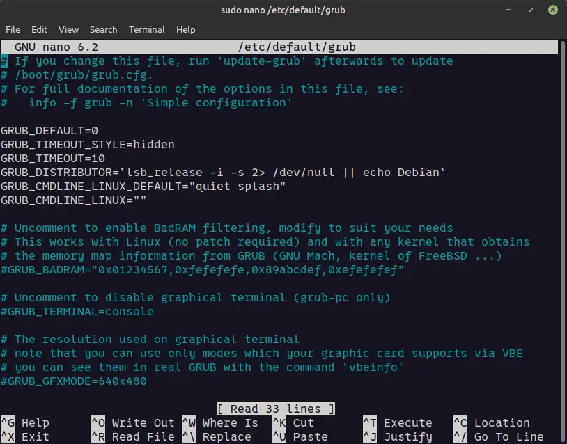
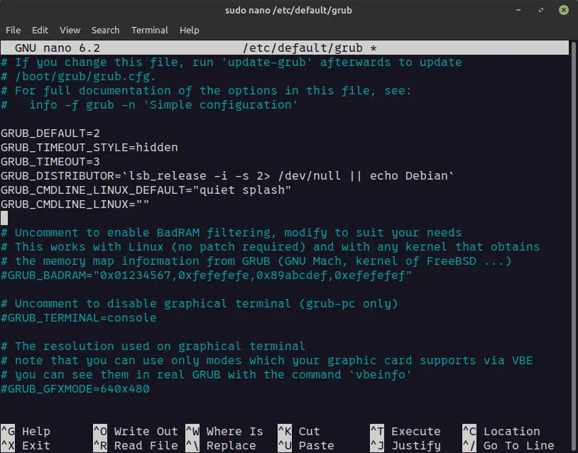
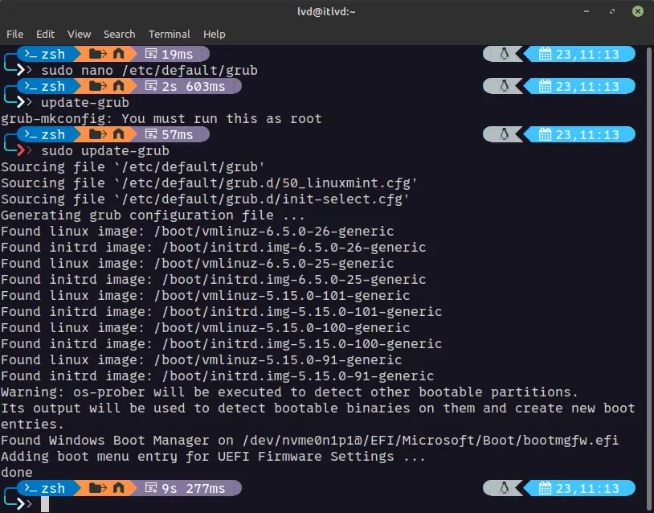

Nhiều bạn cài song song hai hệ điều hành cho công việc và học tập như Windows và Linux. Một số bạn thích cài đặt Linux làm hệ điều hành mặc định. Tuy nhiên, cũng có những bạn muốn hệ điều hành chính là Windows.

Sau khi bạn cài song song hai OS trên máy tính, thì khi bạn bắt đầu khởi động máy, Grub sẽ xuất hiện để bạn chọn OS mà bạn muốn truy cập vào. Nếu như bạn là người sử dụng Windows làm hệ điều hành mặc định thì việc này sẽ khiến bạn khó chịu. Nhưng đừng lo, bạn vẫn có thể tùy chỉnh menu boot này theo ý thích của mình.

## Lựa chọn 1: Sử dụng Grub-customizer

Nếu như bạn là một người dùng yêu thích sử dụng UI, bạn có thể đọc bài viết bên dưới hướng dẫn rất chi tiết. Bài viết của tôi hôm nay không chỉ tập trung vào các cài đặt trên UI, mà còn hướng dẫn các bạn cách khác sử dụng dòng lệnh để làm điều này. Và đương nhiên, bạn có thể chọn bất kỳ cách nào mà bạn muốn.

```bash
sudo apt install grub-customizer
```

[Change Grub Boot Order and Make Windows Default](https://itsfoss.com/grub-customizer-ubuntu/)

## Lựa chọn 2: Sử dụng Grub file trong hệ thống

Đầu tiên, bạn mở grub file trong nano editor. Bạn nên sao lưu lại file này trước khi làm các bước tiếp theo phòng trường hợp bị lỗi.

```bash
sudo nano /etc/default/grub
```

Tiếp theo, bạn sẽ nhìn thấy nội dung của grub file như sau



Bạn chỉ cần chú ý tới 2 thông số là `GRUB_DEFAULT` và `GRUB_TIMEOUT` .

Bạn có thể thay đổi thứ tự thành `2` để setup Windows là hệ điều hành mặc định. Khi bạn khởi động máy tính, các bạn thấy Windows item nó nằm ở dòng thứ mấy thì các bạn điền vào, tuy nhiên, dòng đầu tiên sẽ bắt đầu từ 0.

**💡 Nếu như bạn không muốn setup 1 hệ điều hành mặc định liên tục mà muốn nó nhớ hệ điều hành cuối cùng mà bạn sử dụng, các bạn có thể setup như sau:**

> GRUB_DEFAULT=saved

> GRUB_SAVEDEFAULT=true

Xem thêm tại [offical document](https://www.gnu.org/software/grub/manual/grub/grub.html#Simple-configuration:~:text=If%20this%20option%20is%20set%20to%20%E2%80%98true%E2%80%99%2C%20then%2C%20when%20an%20entry%20is%20selected%2C%20save%20it%20as%20a%20new%20default%20entry%20for%20use%20by%20future%20runs%20of%20GRUB).

Mặt khác, bạn có thể cài thời gian chờ khi bạn lựa chọn OS trong `GRUB_TIMEOUT` .



Cuối cùng nhấn `Ctrl + X` sau đó `y`, và nhấn `Enter` để lưu cài đặt file.

Gần hoàn thành rồi, bạn chỉ cần chạy lệnh bên dưới để cập nhật grub.

```bash
sudo update-grub
```



Bây giờ, bạn chỉ cần khởi động lại máy và kiểm tra thử bạn đã setup đúng chưa.

Ten tèn, vậy là xong. Chúc bạn thành công.
