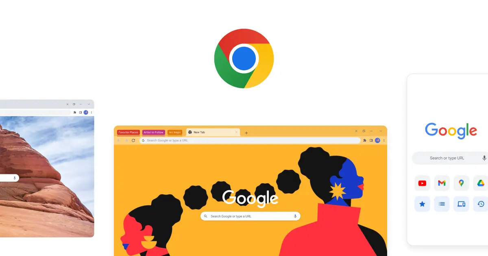
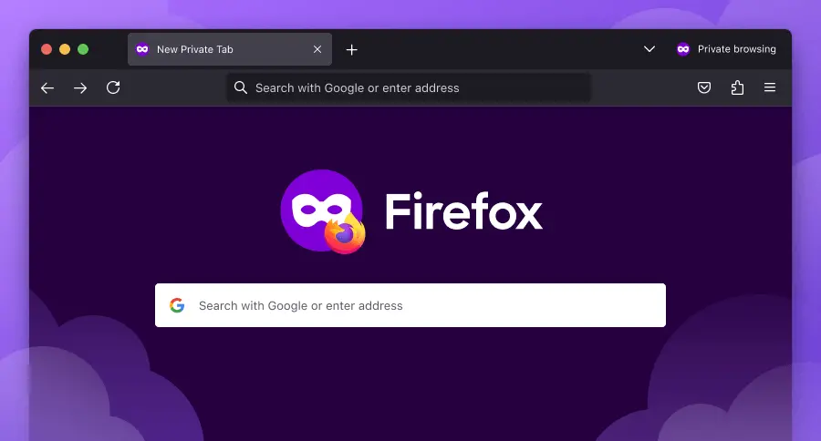
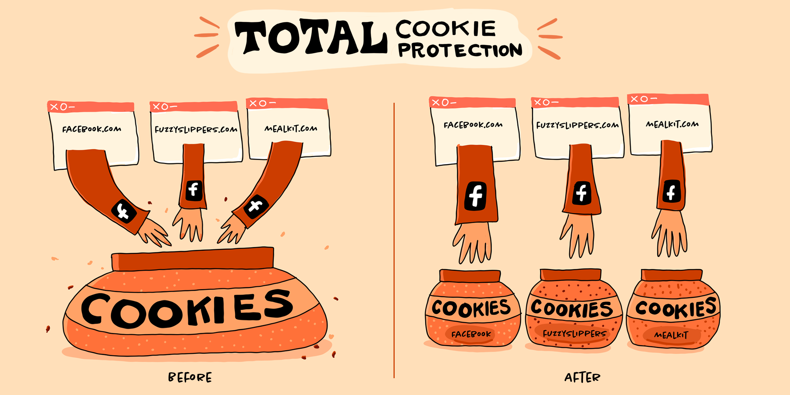
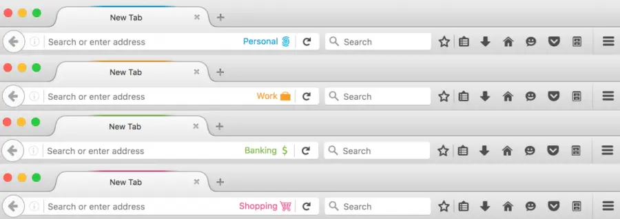
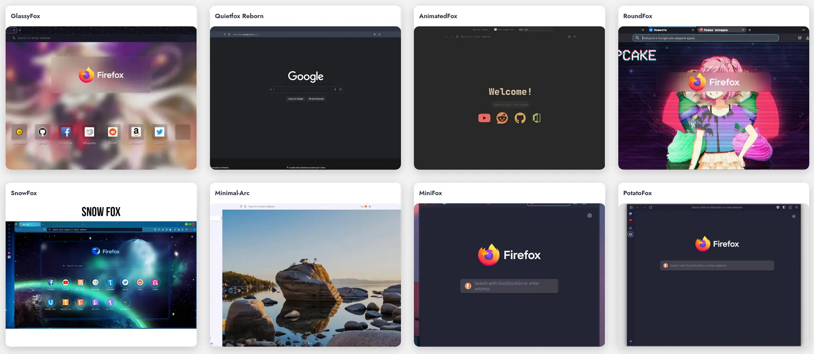

## Thế giới trình duyệt

Có lẽ các bạn chưa biết thế giới trình duyệt biến đổi không ngừng. Liệu bạn có tin được không khi những năm 90, trình duyệt không hề miễn phí như bây giờ. Bạn phải trả tiền để có trình duyệt truy cập vào internet, phổ biến là Netscape. Từ khi Internet Explorer ra đời miễn phí, nó đã thay đổi hoàn toàn thế giới trình duyệt lúc bấy giờ, trình duyệt dần từ trả phí sang miễn phí. Firefox ra đời, Chrome ra đời và vô số trình duyệt khác ra đời cho đến bây giờ có thể kể đến như Edge, Brave, Vivaldi,....

Vậy bạn đã từng hỏi, trình duyệt miễn phí như thế thì tiền đâu để họ có thể duy trì hay không? Có một câu nói khá hay cho vấn đề này

> If you are not paying for it, you are the product.

Hay tiếng Việt là

> Nếu bạn không phải trả tiền thì bạn chính là sản phẩm.

Mình thiết nghĩ câu này đúng, Google là một ví dụ điển hình nhất cho câu nói này. Bạn có thể sử dụng phần lớn sản phẩm của Google một cách hoàn toàn miễn phí, từ Gmail, Google Drive, Google Doc, Youtube,... và nổi tiếng nhất có lẽ là Google Search. Vậy doanh thu đến từ đâu? Câu trả lời hợp lý nhất cho câu hỏi này là **Quảng cáo.** Họ sẽ thu thập tất cả những thông tin từ bạn như sở thích, thói quen, giới tính, lịch sử duyệt web,... nhằm mục đích chính là phân phối quảng cáo sao cho phù hợp nhất với bạn. Nhưng lúc bạn chưa có nhu cầu mua thì quảng cáo vẫn xuất hiện với tần suất dày đặc. Hay có khả năng bạn sẽ là mục tiêu cho các đối tượng chạy quảng cáo lừa đảo? Thậm chí, tệ hơn nữa là thông tin của bạn có thể sẽ bị bán cho bên thứ ba, còn họ làm gì với thông tin đó thì...

## Google Chrome

Có thể các bạn không biết thì Google Chrome có thể được nhìn như là trình duyệt của quảng cáo, nó sẽ thu thập tất cả những thông tin có thể thu thập về bạn, thậm chí nó còn thu thập và dự đoán hành vi của bạn nữa :D. Kể cả các trình duyệt web khác sử dụng chromium thì gần như rất khó để xóa hết mọi tracking từ trong core của Chrome. Nói chung, bạn sử dụng Chrome nói riêng và base on Chromium nói chung thì không còn lựa chọn khác.

Tuy nhiên, đó chỉ là nhược điểm của Chrome, còn ưu điểm của Chrome thì đa số các bạn sử dụng Chrome đã biết: kho extension đồ sộ, lướt web nhanh, tốn ít RAM, nhiều trang web hỗ trợ hơn.... và đặc biệt là dễ sử dụng và tiếp cận hơn.

**Kho extension đồ sộ**: Điều này không cần bàn cãi, kho của Chrome thì rất phong phú, phục vụ hầu hết mọi nhu cầu của người dùng. Gần như có thể nói, khi bạn nghĩ ra tính năng gì thì bạn khả năng cao sẽ tìm thấy tính năng đó trên kho extension của Chrome. Tuy nhiên, kho extension của Chrome cũng có một nhược điểm nguy hiểm là có nhiều extension rác và lừa đảo. Nếu các bạn đã từng sử dụng Ublock thì các bạn có thể tìm được rất nhiều bản Ublock khác nhau trên kho của Chrome và nếu người dùng không tinh ý thì có thể sẽ cài đặt extension lừa đảo nguy hiểm cho trình duyệt.

**Lướt web nhanh**: Đây là một cách nâng cao trải nghiệm người dùng của Chrome. Với góc độ người dùng, tôi không cần biết các anh sử dụng thuật toán gì, code thế nào, nhưng tôi muốn khi tôi search hay click vào một link thì trang web sẽ tải nhanh nhất có thể, ngay lập tức thì càng tốt. Đây là một điểm đáng khen của Chrome và khiến bạn rất khó để có thể chuyển sang trình duyệt khác khi mà tốc độ lướt web có thể sẽ bị chậm đi. Nếu bàn luận về cơ chế này, khi bạn search hoặc di chuyển chuột đến một link nào đó, Chrome đã tải trang của bạn nên khi bạn click vào link thì Chrome chỉ cần đem từ cache ra cho bạn xem thôi, do đó lướt web bằng Chrome bạn sẽ thấy nó chạy rất nhanh. Tuy nhiên, nếu preload như thế, thì bạn sẽ tốn nhiều băng thông hơn đó là giá phải đánh đổi để tăng trải nghiệm người dùng khi lướt web.

**Tốn ít RAM hơn**: RAM là điều hơi khó nói vì nó sẽ bao gồm cả thuật toán, cách thiết kế, công nghệ sử dụng khi lập trình trình duyệt. Với cá nhân mình, thà cho mọi ứng dụng chiếm hết RAM còn hơn là để nhiều RAM dư. RAM bây giờ rất rẻ, nạp vào 16GB - 32Gb chạy cho thoải mái. Tuy nhiên, điều mình muốn nói đến ở đây là có rất nhiều cách để giảm RAM dù cho thiết kế không tốt, như là nén dữ liệu trên RAM (nhìn chung vẫn là thiết kế tốt tuy nhiên phải tốn CPU giải nén), nén dữ liệu trên RAM -> sau đó đem vào SSD -> khi nào dùng thì đem ra lại RAM (cách này thì một mặt nào đó cũng tốt, nhưng cũng xấu). Mình sẽ đánh giá cao hơn khi dữ liệu để trên RAM sao cho ít nhất mà không cần nén vì RAM nhiều nên cho phép tha hồ bung lụa hoặc ít nhất là không chơi ăn gian như ném dữ liệu vào SSD. Ở mục này, mình không đánh giá cao về cách tiêu thụ RAM của Chrome.

**Nhiều trang web hỗ trợ hơn**: Chrome mặc định quá phổ biến rồi, phổ biến đến nỗi lượt truy cập vào Edge là chỉ để tải Chrome. Vì mức độ phổ biến của nó, rất nhiều trang web hỗ trợ cho Chrome, vận hành mượt mà hơn, tốn ít tài nguyên hơn, render ít lỗi hơn.

## Firefox

Wait! Nhưng mà đây là bài viết về Firefox cơ mà sao lại nói Chrome ở đây. Vì mình muốn so sánh cả 2 trình duyệt, mỗi cái có ưu và nhược điểm riêng, ai quen dùng cái nào thì sử dụng. Ngoài ra, muốn biết Firefox có gì hay thì ta phải đặt bàn cân với trình duyệt khác thì mới có thể nói nó hay ở chỗ nào được chứ, đúng không? Gét gô dô bài!

Khi nói đến Firefox, mình nghĩ sẽ có nhiều bạn có trải nghiệm với Firefox không được tốt như load chậm, giao diện xấu,... Đúng như thế, Firefox load khá chậm và giao diện khá xấu nếu so sánh với Chrome, nhưng đó là câu chuyện của nhiều năm về trước. Firefox hiện tại từ version 128 đã load nhanh hơn rất nhiều, có thể nói là ngang Chrome hoặc cùng lắm là chậm hơn Chrome một xíu không khác biệt (tính thời điểm bắt đầu load trang web, không tính thời gian từ Google vào vì có preload). Giao diện cũng đã được đổi mới trông hiện đại hơn nhiều, tuy nhiên thanh tab bar vẫn chiếm diện tích khá nhiều.

Firefox là một trình duyệt bạn có thể custom nhiều thứ, mặc định khi cài đặt Firefox thì chưa được tối ưu lắm, vì nó sẽ setting sao cho phù hợp với nhiều đối tượng nhất (máy yếu, máy mạnh, đời mới, đời cũ gì cũng sử dụng được) nên khi bạn có máy mới và mạnh thì khi sử dụng Firefox bạn sẽ không thể có trải nghiệm bốc cháy với Firefox được. Tuy nhiên, tin vui khi sử dụng Firefox là bạn hoàn toàn có thể tùy chỉnh Firefox sao cho phù hợp với nhu cầu của bạn, không bị gò bó, nhưng đây cũng đồng nghĩa với việc bạn sẽ tốn thời gian ban đầu để setup, sau khi setup xong bạn có thể backup lại thì sau chỉ cần một vài phút là khôi phục như cũ.

Ở cùng hạng mục, mình sẽ đi qua từng ý bên Chrome để so sánh với Firefox.

**Lướt web nhanh**: Firefox lướt web nói chung là nhanh, không hề chậm như mọi người vẫn nghĩ. Tuy nhiên, cơ chế của Firefox mặc định là không sử dụng preload, cho nên bạn sẽ có cảm giác lướt web chậm hơn Chrome nhưng sẽ tiết kiệm băng thông hơn Chrome. Bạn hoàn toàn có thể cài đặt để nó preload trước để tăng tốc độ lướt web. => Mình thích cách Chrome preload hơn.

**Tốn ít RAM**: Khi chạy Firefox bạn sẽ thấy Firefox chiếm nhiều RAM hơn, do Firefox để nguyên dữ liệu trên RAM không hề nén. Với mình, mình thích cách Firefox hơn vì nó làm tăng tốc độ _sử dụng Firefox_ hoặc reload trang web. Mình thậm chí còn ép Firefox cache trên RAM thay vì cache trên ổ cứng như cài đặt mặc định của Firefox. Nếu máy bạn ít RAM thì cứ để nguyên mặc định sử dụng.

**Nhiều trang web hỗ trợ**: Nếu nói về số lượng trang web hỗ trợ thì Chrome là vô đối, Firefox rất khó để so sánh với Chrome. Tuy nhiên, phần lớn trang web hoạt động rất tốt trên Firefox, rất ít trang web mà bị lỗi với Firefox. Nhưng so sánh thì Chrome vô đối.

Có một tin buồn khi bạn sử dụng Firefox, bạn có thể bị bóp bẩn bởi chính Google, khi bạn truy cập các trang dịch vụ của Google như Google Drive hay Youtube. Google sẽ bóp cho chậm hơn khi sử dụng với Chrome. Một ông lớn mà làm vậy thì quá tiếc, tuy nhiên, trải nghiệm không phải là tệ, chỉ là chậm hơn so với Chrome thôi.

## Điều hay của Firefox

So sánh nãy giờ thấy Firefox có gì hay đâu ta? Với 3 mục trên, bạn sẽ thấy Chrome sẽ rất tốt với người dùng cơ bản. Tuy nhiên, với các nét đặc biệt của Firefox sau đây, bạn có thể muốn trải nghiệm thử với Firefox đấy.

### Quyền riêng tư và bảo mật

Firefox là một trình duyệt Open-source và đề cao quyền riêng tư. Nói như thế không có nghĩa là Firefox không thu thập thông tin của bạn mà nó có nghĩa là bạn hoàn toàn có thể tự chủ và tắt hoạt động theo dõi của Firefox- điều mà Chrome gần như là bất khả kháng.

Cho các bạn chưa biết, Firefox mặc định bật [Total Cookies Protection](https://blog.mozilla.org/security/2021/02/23/total-cookie-protection/). Đây là một tính năng đáng giá của Firefox, nó mặc định sẽ cách ly cookies khỏi các website bên thứ ba. Trang web nào dùng cookies của trang đó không chung đụng gì cả. Giả sử bạn truy cập vào một trang web, trang web đó có nhúng bình luận Facebook thì Facebook cũng không thể thu thập được. Tuy nhiên, các trang web đó vẫn theo dõi được thông qua Fingerprint tức là nó sẽ định danh bạn thông qua một vài thông tin như kích thước màn hình, thao tác,... mà không cần dùng tới cookies để định danh bạn là ai! Cách chống ư? Có thôi, nhưng không nên, chúng ta chỉ hạn chế chứ không cần phải quá bảo mật đến như thế vì nó sẽ đánh đổi trải nghiệm người dùng như là tốc độ lướt web.

### Punnycode giả mạo tên miền

Bạn có thể bật punycode để tránh vào trang web lừa đảo. Như `levandong.dev` thì nó có thể fake lại thành `lêvandong.com` nhìn không kỹ rất dễ nhầm lẫn, nhưng đây là trường hợp dễ, hacker nó fake đến mức bạn không nhận ra điều khác biệt luôn cơ. Với Firefox nó sẽ hiện `lêvandong.com` theo dạng `xn--lvandong-k1a.com`.

### Container

Với một người mới thì bạn sẽ khá khó khăn khi hiểu được định nghĩa Container trong Firefox. Nhưng tin mình đi, khi bạn biết cách sử dụng thì bạn rất khó để quay về Chrome.

> Gặp nhau rồi thật khó lìa xa

Nói đơn giản là nó như tab ẩn danh nhưng nó không xóa đăng nhập của bạn, tắt máy bạn vẫn đăng nhập bình thường.

Với Container trên Firefox, bạn có thể đăng nhập nhiều tài khoản ở bất kỳ trang web nào trên cùng một cửa sổ Firefox. Nói sơ qua Chrome trước, giả sử bạn muốn đăng nhập vào trang Github, bạn chỉ có thể đăng nhập trong 1 tài khoản Github A trong cùng 1 profiles. Bạn muốn đăng nhập vào tài khoản khác là Github B thì bạn phải tạo Profiles mới hoặc mở tab ẩn danh lên để đăng nhập. Nhưng câu hỏi là làm sao để vẫn đăng nhập cả 2 account đây? Firefox hỗ trợ bạn điều đó. Hình trên bạn có thể chia ra làm nhiều container như cá nhân, làm việc, học tập, shopping,... cho nhiều mục đích khác nhau.

Ngoài ra, bạn có hàng tá extension bổ trợ cho Container này. Bạn có thể cài proxy cho từng container. Khi đó bạn lướt web bình thường, nhưng Container thì mới chạy qua proxy, và mỗi container sẽ chạy một proxy khác nhau nếu bạn muốn.

### Lướt các trang web bị chặn

Medium là một trang web hay nhưng bị chặn truy cập tại Việt Nam. Nếu bạn muốn truy cập trang web này, bạn cần phải fake IP sang một nước khác không bị chặn và tốc độ lướt web của bạn có thể bị ảnh hưởng. Firefox hiện tại đã bật ECH theo mặc định và bạn chỉ cần bật DNS mã hóa là có thể truy cập trang web bị chặn với tốc độ max ping. Lưu ý, đây không phải là fake IP, IP của bạn vẫn thế, nhưng có thể vượt mặt nhà mạng để truy cập website bị nhà mạng chặn thôi.

### Cài nhiều Addon và dùng lâu ngày

Có một sự thật là khi bạn dùng Firefox, bạn cài addon thì sẽ không làm giảm hiệu năng của bạn và RAM không tốn nhiều, trải nghiệm của bạn sẽ rất mượt mà. Addon trên Firefox họ làm rất tốt. Tuy nhiên, nếu bạn sử dụng Chrome thì bạn có khả năng sẽ bị chậm khi cài quá nhiều addon và tốn RAM rất nhiều. Và khi sử dụng lâu ngày, Firefox hay Chrome đều chậm đi, với Firefox bạn chỉ cần xóa _cache_ và _offline data_ thì nó sẽ nhanh trở lại, nhưng với Chrome bạn chỉ có thể xóa nguyên profiles thôi.

### Khả năng backup của Firefox rất tuyệt vời

Mình cố tình ghi đánh giá vào tiêu đề (sẽ không công bằng với Chrome) vì nó quá mạnh. Thật sự, mình đã yêu Firefox từ Container và khả năng backup của Firefox. Khi sử dụng trình duyệt web nói chung, bạn sẽ đăng nhập rất nhiều website, addon cài đặt rất nhiều, setting cực kỳ nhiều. Mỗi lần bạn cài lại máy, bạn phải đi đăng nhập lại từng website một, cài lại addon (có sync hỗ trợ, nhưng setting trong addon phải cài bằng tay), cài lại setting trong trình duyệt.

Đến với Firefox, bạn chỉ cần copy thư mục profiles đem đi bất cứ đâu thì bạn có thể khôi phục lại toàn bộ mà không hề có lỗi. Mình là một người hay cài lại hệ điều hành. Mình bỏ thư mục profiles của Firefox trong ổ Data, và khi cài lại Firefox thì chỉ cần trỏ profiles tới thư mục Data là được. Mọi thứ được giữ nguyên. Thậm chí, bạn ở nhà, đem profiles lên máy công ty cũng được - tuy nhiên mình không khuyến khích lắm.

Xem thêm: [Cách sao lưu và khôi phục Firefox toàn vẹn](/backup-khoi-phuc-firefox/).

### Tốc độ trên Linux

Trên Linux thì Firefox là trình duyệt mặc định rồi. Firefox trên Linux chạy rất bốc. Không thua kém gì Chrome thậm chí còn nhanh và mượt hơn Chrome nữa.

### Tùy chỉnh giao diện Firefox

Ở trên mình có nói giao diện Firefox xấu so với Chrome. Đến với Firefox bạn có thể thay đổi giao diện Firefox 180 độ, thậm chí có thể biến giao diện của nó thành Chrome nếu muốn. Bạn có thể truy cập [FirefoxCssStore](https://firefoxcss-store.github.io/) để thay áo cho em nó.

### Ublock

Ublock là tiện ích chặn quảng cáo phổ biến trên toàn thế giới có thể nói là top 1. Tuy nhiên, Chrome hiện nay đã lên Manifest V3, tóm tắt của Manifest V3 là hạn chế khả năng cập nhật của các extension chặn quảng cáo. Và Firefox là điểm đến rất tốt cho việc update chặn quảng cáo này của Google. Ngoài ra, developer của Ublock cũng xác nhận Ublock hoạt động tốt nhất và nhanh nhất trên Firefox dù cho là Chrome sử dụng Manifest V2 hay không. Nếu bạn muốn tốc độ chặn quảng cáo nhanh, chạy bốc khói thì đến với Firefox.

### Lưu trên RAM

Firefox có thể lưu mọi thứ trên RAM mà không cần dùng tới RAM Disk, nhưng bạn cần phải chỉnh chọt 1 chút. Khi đó, Firefox sẽ chạy trên RAM thay vì Disk, tăng tốc độ lên rất nhiều, vì tốc độ trên RAM nhanh hơn Disk mà.

### Tăng tốc độ tải trang với Preload

Firefox có thể hack giống Chrome bằng cách preload. Bạn sẽ phải bật bằng tay và setup một tý. Nhưng không hoàn toàn bằng Chrome được, đây là nhận xét của mình, Chrome vô đối khoản này.

### Font chữ

Font chữ trên Firefox render thật sự rất đẹp, nó không bị mảnh hay vỡ như trên Chrome. Bạn có thể trải nghiệm thử sẽ thấy sự khác nhau giữa 2 trình duyệt.

### Chụp website có sẵn

Firefox có tính năng chụp hình có sẵn rất tiện. Đương nhiên nếu so với Edge thì Edge có thêm công cụ sửa hình nữa. Nhưng điểm ăn tiền của Firefox, là nó chụp màn hình theo element. Ví dụ, bạn muốn chụp tấm hình về banner thôi, với Edge bạn sẽ phải canh góc sao cho khớp với hình banner và chụp. Với Firefox, bạn chọn banner và chụp.

### Eyedropper

Công cụ lấy mã màu trực tiếp trên website, Firefox có sẵn tính năng này, bạn không cần cài đặt addon hay tool bên ngoài nào cả, chỉ cần chọn vùng cần lấy màu và click, Firefox sẽ copy mã màu đó cho bạn.

## Kết

Firefox là một trình duyệt đáng để thử. Nếu hợp, bạn có thể dùng làm trình duyệt chính. Mình cũng chuyển từ Chrome sang Firefox, vì 2 tính năng quá dính là Container và Backup Profiles mà mình không thể đổi sang một trình duyệt nào khác nữa. Nếu bạn là một người mới từ Chrome sang, bạn hãy sử dụng tính năng Import của Firefox để chuyển, và chịu khó thời gian ban đầu vì chưa quen cách sử dụng, nhưng một thời gian mình tin là bạn quen sẽ cảm thấy thích nó.

Mình đã từng giới thiệu nhiều người, và họ cảm thấy tại sao họ không thể biết được sớm hơn. Người dùng Firefox khá ít và mặc định cài máy các kỹ thuật viên sẽ cài Chrome thay vì Firefox. Nhưng thật sự cũng rất khó nói, Firefox khi cài đặt mà không chỉnh thì sẽ không khác gì Chrome thậm chí thua Chrome, nhưng một khi sử dụng, tinh chỉnh cho phù hợp với nhu cầu, thì bạn sẽ thấy Chrome không có giải pháp tương tự.

Bài viết này chỉ mang mục đích giới thiệu và khuyến khích các bạn sử dụng Firefox vì đề cao quyền riêng tư bảo mật, tính năng hay ho của nó. Các bài viết tiếp theo sẽ là bài viết hướng dẫn cài đặt Firefox cho phù hợp với từng cá nhân.

## Tham khảo

[Tổng hợp những addon chất cho Firefox / Chromium](https://voz.vn/t/tong-hop-nhung-addon-chat-cho-firefox-chromium.682181/#post-22174021)
