## A. Dẫn nhập

Liệu rằng các bạn đã từng sử dụng mạng xã hội bao giờ chưa? Giả sử mỗi người tham gia mạng xã hội là một node và mối liên hệ của mỗi người là một liên kết giữa các node. Thì chúng ta sẽ có hình mô tả như dưới đây

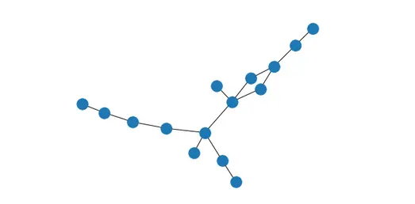

Vậy các bạn có bao giờ thắc mắc, khi có một đồ thị như thế thì người ta sẽ làm gì với nó không? Ở một khía cạnh nhất định, người ta sẽ nghiên cứu cách các mối liên hệ của các cá nhân với nhau, liệu rằng có một điểm chung giữa các người này hay không? Liệu họ có thể sẽ có hành động nào tiếp theo hay không? Đó là một trong vô số vấn đề mà người ta nghiên cứu. Nhưng có phải bạn cũng cảm thấy, thường thì người chung một cộng đồng nào đó thì thường có các điểm chung giống nhau hay không? Vậy làm sao ta có thể phát hiện được cộng đồng đó để nghiên cứu tiếp theo? Đây là bài viết phục vụ cho bài toán này.

Trước tiên, chúng ta cần tìm hiểu tổng quan về thuật toán này trước

> Đây là thuật toán học không giám sát. Tuy nhiên, cần biết trước số lượng cộng đồng thì thuật toán này mới có thể hoạt động được. Ý tưởng dựa trên việc: nút đang xét sẽ thuộc về cộng đồng có tổng trọng số kết nối tới nút đó là lớn nhất.

## B. Mô tả chi tiết hoạt động

Mới đầu, tất cả các đỉnh chưa có lớp cụ thể. Cho nên, ta sẽ gán k lớp vào k điểm bất kì.

Sau đó, ở lần lặp đầu tiên, ta xét một điểm ngẫu nhiên thuộc vào một lớp nào đó dựa vào lớp của chính nó và lớp của những điểm lân cận với nó và tính trọng số của k lớp. Trọng số ở lớp nào cao nhất thì đó là lớp của đỉnh ấy, nếu trọng số ở lớp hiện tại bằng với trọng số ở lớp cao nhất (chúng ta có thể có nhiều lớp mà đỉnh ấy thuộc về) thì ta giữ nguyên lớp hiện tại, mỗi đỉnh chỉ duyệt qua 1 lần. Sau khi duyệt hết tất cả các đỉnh, ta kết thúc lần lặp đầu tiên. Ở lần lặp thứ hai, ta chọn một đỉnh bất kì và tính trọng số như lần lặp đầu tiên cho đến khi đi qua hết tất cả các điểm, mỗi điểm một lần. Và cứ thế, lặp lại cho đến khi không có sự thay đổi nào nữa.

Chắc hẳn đọc một đoạn nhiều dòng, bạn sẽ thấy hơi khó hiểu, ta có thể đến ngay với ví dụ để có thể dễ hiểu hơn.

## C. Ví dụ

### Triển khai thuật toán

#### Triển khai với 2 điềm bắt đầu là C và D.

Mới đầu, ta gán ngẫu nhiên đỉnh C thuộc lớp đỏ, D thuộc lớp xanh và với trọng số là 1. Và điểm hiện tại đang xét là đỉnh B.

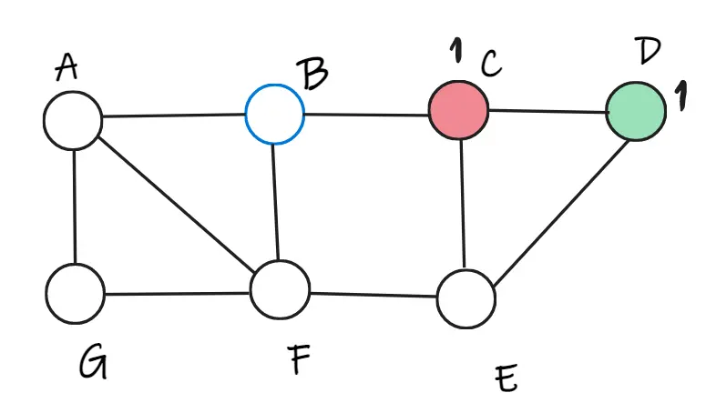

Ở đỉnh B, ta tính được B sẽ thuộc lớp đỏ vì tổng trọng lượng bằng 1 và tổng trọng lượng thuộc lớp xanh là bằng 0. Tính lại trọng số ở tất cả các đỉnh. Tiếp tục, ta chọn ngẫu nhiên đỉnh E.

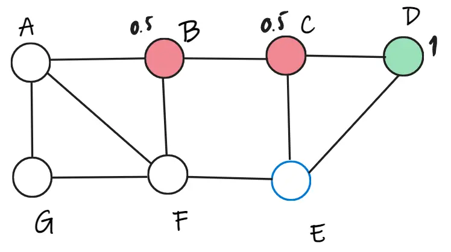

Tại đỉnh E, ta tính được tổng trọng số của lớp đỏ là 0.5 và tổng trọng số của lớp xanh là 1. Vậy nên, đỉnh E thuộc về lớp xanh. Tính toán lại trọng số và chọn ngẫu nhiên đỉnh A.

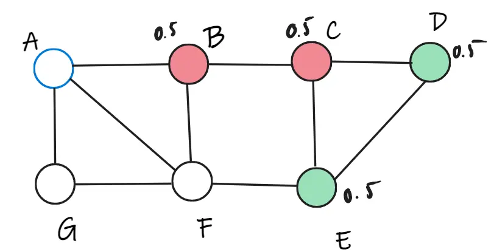

Dựa vào cách tính như trên, ta có thể dễ dàng biết được đỉnh A thuộc lớp đỏ. Và tính toán lại trọng số. Chọn ngẫu nhiên đỉnh C.

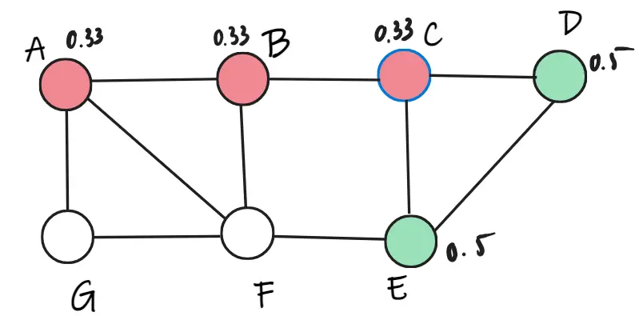

Ta có thể tính được trọng số của C khi thuộc lớp đỏ là 0.66, trọng số của C khi thuộc lớp xanh là 1. Vì thế, C thuộc lớp xanh. Ta cập nhật lại trọng số và cứ thế tiếp tục ngẫu nhiên cho các đỉnh còn lại F, G.

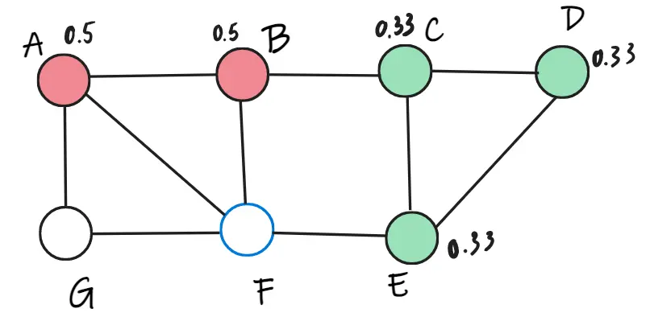

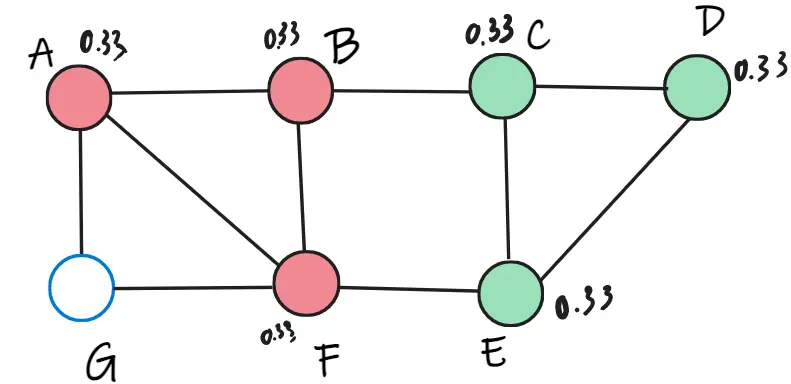

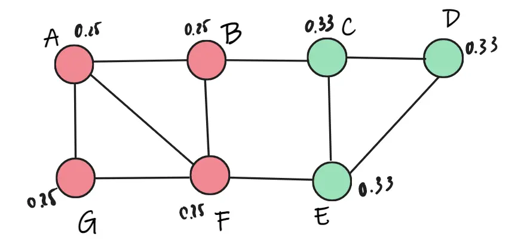

Đến vòng lặp thứ 2, ta không thể tìm thấy đỉnh nào thuộc lớp mới nữa, nên thuật toán dừng lại.

#### Triển khai với 2 điểm bắt đầu là B và G

Giả sử như bây giờ chúng ta thử chọn random 2 điểm bắt đầu ở một vị trí khác là G và B.

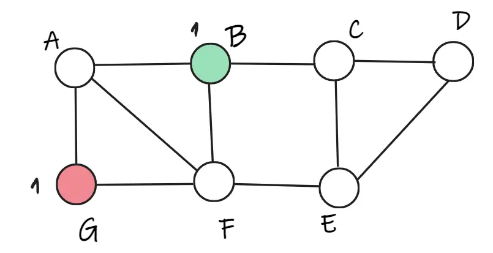

Xét F, do bằng nhau nên ta chọn các màu là như nhau, ở đây ta chọn đỏ. Tương tự cho các điểm tiếp theo lần lượt là: F đỏ, A xanh, E đỏ, C xanh, D đỏ, G xanh, B xanh.

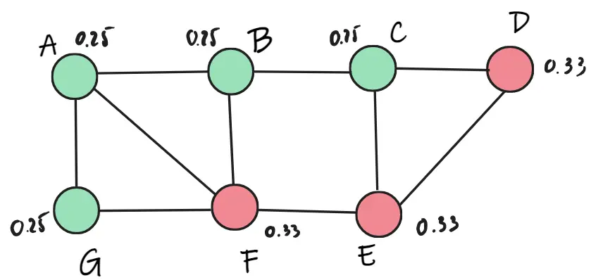

Lần lặp thứ 2, ta tiếp tục chọn ngẫu nhiên, ta chọn F. Ta thấy F trọng số thuộc về lớp xanh là 0.75, thuộc về lớp đỏ là 0.66. Vậy F thay đổi thành lớp xanh.

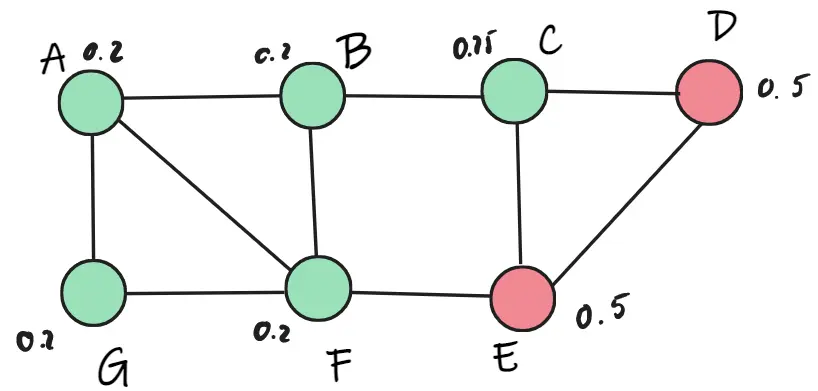

Tiếp theo ta chọn ngẫu nhiên điểm C. Ta thấy C trọng số C thuộc lớp xanh chỉ 0.45, nhưng lớp đỏ là 1. Nên C thay bằng lớp đỏ.

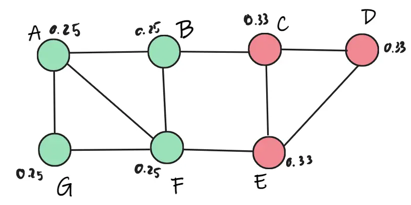

Tiếp tục xét các điểm A, B, D, E, G. Tuy nhiên, không thay đổi trọng số và thay đổi lớp. Đến vòng lặp thứ ba, xét tất cả các điểm A, B, C, D, E, D, G thì không có sự thay đổi lớp nào, nên thuật toán dừng.

Các bạn có thấy 2 cách chọn điểm khác nhau sẽ dẫn đến kết quả duyệt nhiều hay ít khác nhau không?

> Do vậy, chúng ta có thể thấy cách chọn điểm cũng ảnh hưởng đến tốc độ chạy của thuật toán.

### Nhận xét thuật toán

- Tổng trọng số của các đỉnh thuộc một lớp là bằng 1.

- Với những điểm có liên kết yếu với các lớp khác thì nó có thể bị thay đổi lớp trong quá trình chọn điểm ngẫu nhiên. Ngược lại, trong một lớp nếu có liên kết càng mạnh (có nhiều liên kết trong cộng đồng) thì càng khó bị ảnh hưởng bởi các điểm bên ngoài. Xem hình 1.

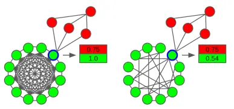

- Cách chọn điểm để duyệt cũng ảnh hưởng đến tốc độ tìm k lớp thoả mãn.

## D. Kết luận

Thật ra, tôi viết bài này vì khi xưa tìm hiểu thì không có thông tin bài viết về thuật toán này bằng tiếng Việt. Nên tôi muốn chia sẽ nội dung này bằng tiếng Việt để giúp mọi người có thể tiếp cận dễ dàng hơn. Tôi mong rằng bài viết này có thể giúp bạn trong quá trình tìm hiểu.

Ngoài ra, nếu bạn có nhu cầu tìm hiểu thêm. Tôi có tìm hiểu 2 thuật toán Thuật toán Girvan – Newman và Thuật toán Fluid Communities. Tôi cũng có so sánh tốc độ và rút trích một vài thông tin. Bạn có thể tham khảo [tại đây](https://1drv.ms/b/s!Ar_yOq_BzQ59hY53jEYkl_cOdw6Y-w?e=V4sFFb).

## E. Tham khảo

[Fluid Communities: A Competitive, Scalable and Diverse Community Detection Algorithm](https://www.pnas.org/doi/epdf/10.1073/pnas.122653799)

[HPAI-BSC/Fluid-Communities - Github](https://github.com/HPAI-BSC/Fluid-Communities)
