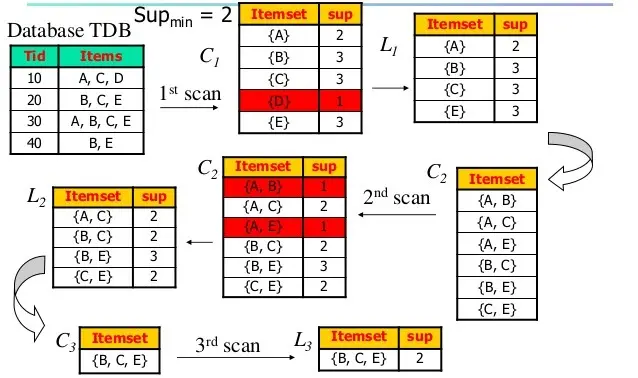

## Giới thiệu

Mở đầu bài viết, chúng ta hãy tìm hiểu về quan hệ điều kiện sau đây: Nếu A thì B. Bạn đọc vào câu này, bạn sẽ biết được việc A xảy ra thì nó sẽ kéo theo 100% việc B cũng sẽ xảy ra. Vậy với câu trên bạn sẽ thấy sự ràng buộc giữa A và B. Ví dụ:

> Nếu trời mưa thì đường ướt.

Bạn có thấy thông tin này nó đương nhiên và không hữu ích? Và những thông tin kiểu này thường không phải là thông tin mới, nó là cái điều mà ai cũng biết ấy.

Tuy nhiên trong cuộc sống, quan hệ điều kiện trên nó thường đi chung với các từ như: _thông thường, gần như, phần lớn_. Lúc này, nó không phải là điều mà ai cũng biết nữa và nó cũng mất đi sự ràng buộc. Ví dụ:

> Nếu mua áo sơ mi thì thường người ta cũng sẽ mua cà vạt.

> Gần như nếu bạn học giỏi thì sẽ nhận được học bổng.

> Nếu bạn tham gia cuộc thi này thì 75% bạn sẽ đoạt giải.

Các thông tin loại này mới hữu ích. Nhưng để có thông tin loại này thì bạn sẽ cần rất nhiều dữ liệu để rút ra được, vì đơn giản nó không phải là cái điều ai cũng biết. Mà thường những cái mà ít người biết thì mới có giá trị.

Bây giờ, giả sử giờ bạn là một doanh nhân, bạn có 4 hoá đơn các món hàng mà khách hàng đã mua. Và bạn muốn bán được nhiều hơn nhưng không biết làm thế nào để khách hàng có thể mua thêm vài món nữa để tăng doanh số?

Thế nên, bạn mới suy nghĩ đến việc: "Liệu rằng khách hàng mua snack thì có mua thêm nước lọc không? Hay là thường thì khách hàng mua nước lọc thì sẽ mua sack? Liệu hai món hàng này nó có liên quan gì nhau không?".

Bạn có thể biểu diễn lại câu trên như sau cho ngắn gọn:

$$ snack \Rightarrow water = ?\% $$

$$water \Rightarrow snack = ?\%$$

Tức là xác suất họ mua snack thì mua water là bao nhiêu? Và ngược lại.

| TID | Items                 |
| --- | --------------------- |
| 10  | sữa, chuối, nước lọc  |
| 20  | bánh, chuối, táo      |
| 30  | sữa, bánh, chuối, táo |
| 40  | bánh, táo             |

- **TID**: Transaction ID. Bạn có thể hiểu nó dùng để định danh. Mà định danh thì thích đặt gì không được miễn không trùng nhau, nên mình không đặt là 1,2,3,4 để tránh nhầm lẫn.
- **Items**: Là các món hàng mà khách hàng mua ứng với mã số hoá đơn.

## Luật kết hợp

$$X \Rightarrow Y$$

$$X\subset I, Y \subset I \space | \space X \cap Y = \emptyset$$

- I là **Items**, chứa danh sách các items mình theo dõi.
- **Có nghĩa là**: $X$ kéo theo $Y$ thì $X$ và $Y$ là hai item khác nhau và phải nằm trong danh sách items đang xét, chứ đang xét snack trong bách hoá xanh mà tự dưng có ông nào đó đem snack ở tiệm tạp hoá xét ké làm sao mà được. Và có mặt thằng $X$ thì cũng có mặt thằng $Y$ với một xác suất nào đó.

Giờ người ta mới suy nghĩ để tránh phải phát sinh các tập không có ý nghĩa thì người ta nghĩ ra hai độ đo:

- **Độ support**: độ phổ biến, ký hiệu là $s$. Bạn có thể hiểu nó là xác suất để $X$ xuất hiện trong tất cả hoá đơn. Cách tìm độ support? Đếm chứ làm gì nữa, đếm $X$ xuất hiện bao nhiêu trong hoá đơn, ghi ra là xong. Độ phổ biến tổi thiểu là $s_{min}$.
- **Độ confident**: độ tin cậy, ký hiệu là $c$. Là xác suất để $X \Rightarrow Y$ là bao nhiêu, là xác suất có điều kiện $P(Y|X)$, xác suất thằng $Y$ xảy ra khi có mặt thằng $X$ trong hoá đơn là bao nhiêu? Tức là mình tìm ra được cặp $X,Y$ rồi, tìm $X\Rightarrow Y=?\%$ hay $Y\Rightarrow X=?\%$. Độ tin cậy tối thiểu là $c_{min}$​.

### Bài toán khai thác luật kết hợp

Thường $s_{min}$​ và $c_{min}$​ là do người dùng cho. Tại sao là do người dùng cho? Vì khi bạn đang làm doanh nghiệp, bạn muốn tìm ra danh sách các mặt hàng nào có độ phổ biến $s_{min} > \alpha$, và tìm ra luật kết hợp $A\Rightarrow B$ với độ tin cậy là bao nhiêu thì lấy luật kết hợp đó. Vì vậy, người dùng thích chọn con số bao nhiêu thì người ta chọn, mình chỉ dựa vào đó để tìm thôi. Điều kiện tìm:

$$s \lbrace X\rightarrow Y  \rbrace > s_{min}$$

$$c \lbrace X\rightarrow Y \rbrace > c_{min}$$

Những tập $Z$ có độ phổ biến $s_Z \geqslant s_{min}$​ được gọi là Large Items.

Những tập $Z$ có độ phổ biến $s_Z < s_{min}$​ được gọi là Small Items.

## Thuật toán Apriori

### Tính chất của Apriori

> Mọi tập con của một tập phổ biến đều phổ biến

Nếu $\lbrace A, B\rbrace$ có $s_{min} = \alpha \Rightarrow A \And B$ có $s_{min} = \alpha$.

Tức là, tập chứa $A,B$ mà có $s_{min} = \alpha$ thì khi mình tách lẻ $A$ và $B$ thì $s_{min}$ của $A$ hay $B$ gì cũng $=\alpha$. Trong đó, $A,B$ là các items.

> Mọi tập mẹ của một tập không phổ biến đều không phổ biến

Nếu $\lbrace A| B \rbrace ,s_{min}< \alpha \Rightarrow \lbrace A, B \rbrace$ có $s_{min} < \alpha$.

Tức là chỉ cần $A$ hoặc $B$ mà không phổ biến, thì nó nằm ở trong tập $Z$ nào đi nữa thì tập $Z$ ấy cũng không phổ biến.

Nói dễ hiểu thế này, hội tóc đỏ (tập phổ biến) thì tất cả thành viên (tập con) phải có tóc màu đỏ (đều phổ biến). Nhưng chỉ cần 1 thằng tóc xanh (không phổ biến) lọt vô thì cái hội đó không còn là hội tóc đỏ nữa (không còn là tập phổ biến).

### Thuật toán tìm kiếm Apriori

**Bước 1**: Tìm tập phổ biến 1-items (tập chỉ có 1 items).

**Bước 2**: (Loop) Tạo các tập ứng viên k-items từ các tập k-1 items.

**Bước 3**: Kiểm tra độ phổ biến của ứng viên trên CSDL. Chỉ lấy các Large Items làm tập ứng viên, bỏ qua Small Items.

**Bước 4**: Dừng khi không tạo ra được tập phổ biến hay tập ứng viên.

### Ví dụ

Lấy ví dụ bài toán của doanh nhân ở trên làm thử, họ yêu cầu $s_{min}=50 \\%$ và $c_{min}=80\\%$:

| TID | Items                 |
| --- | --------------------- |
| 10  | sữa, chuối, nước lọc  |
| 20  | bánh, chuối, táo      |
| 30  | sữa, bánh, chuối, táo |
| 40  | bánh, táo             |

Đầu tiên, chúng ta cần lập tập ứng viên 1-items. Ta đếm sự xuất hiện của nó trong CSDL. Ta được tập ứng viên candidate $C_1$​

| Items    | s   |
| -------- | --- |
| sữa      | 2   |
| bánh     | 3   |
| chuối    | 3   |
| nước lọc | 1   |
| táo      | 3   |

Trước khi đi tiếp, ta đi tìm ý nghĩa của bảng trên. Sữa có độ phổ biến $s=3$ tức là nó xuất hiện $75\\%$. Tức là $75\\%$ hoá đơn có chứa sữa. Nếu so với $s_{min}=50\\%$ thì nó lớn hơn và thuộc về Large Items.

Nhưng các bạn thấy tìm kiểu $\\%$ thấy cực quá, tính toán nhiều, nên đổi sang số lần xuất hiện cho dễ. $s_{min}=50\\%=2$ lần xuất hiện. $50\\%$ của 4 hoá đơn là 2.

Tới bước này, chúng ta sẽ so sánh và chỉ chọn những items nào $\geqslant s_{min}$​. Nên ta chỉ lấy items nào $\geqslant 2$ ta có được tập phổ biến $L_1$:

| Items | s   |
| ----- | --- |
| sữa   | 2   |
| bánh  | 3   |
| chuối | 3   |
| táo   | 3   |

Khi có tập phổ biến $L1$​ ta tìm tập ứng viên $C2$​ bằng cách kết (join) các items lại với nhau. Tập ứng viên $C2$​:

| Items       | s   |
| ----------- | --- |
| sữa, bánh   | 1   |
| sữa, chuối  | 2   |
| sữa, táo    | 1   |
| bánh, chuối | 2   |
| bánh, táo   | 3   |
| chuối, táo  | 2   |

$L2$ xoá các record có $s<s_{min}=2$:

| Items       | s   |
| ----------- | --- |
| sữa, chuối  | 2   |
| bánh, chuối | 2   |
| bánh, táo   | 3   |
| chuối, táo  | 2   |

Ta tìm tập ứng viên $C3$​:

| Items                 | s   |
| --------------------- | --- |
| sữa, bánh, chuối      | 1   |
| sữa, bánh, chuối, táo | 1   |
| sữa, chuối, táo       | 1   |
| bánh, chuối, táo      | 2   |

Tập phổ biến $L3$​ xoá các ứng viên $<2$, ta được:

| Items            | s   |
| ---------------- | --- |
| bánh, chuối, táo | 2   |

Ta không thể tìm được tập ứng viên $C4$​ vì vậy $C4=\emptyset$. Tới đây thuật toán dừng. Ta có được các tập 3 - items là {bánh, chuối, táo}.

Dưới đây là bức hình mô tả tổng quan lại quá trình trên, với _A = sữa, B = bánh, C = chuối, D = nước lọc, E = táo_.

Ta có được tập phổ biến ta mới tìm xem luật kết hợp thế nào?

Ở đây có 3 items nên ta có nhiều luật kết hợp:

- bánh → chuối, táo.
- bánh, chuối → táo.
- chuối, táo → bánh.
- táo → chuối, bánh.
- ...

Vậy giờ ta muốn tính xác suất của từng cái để xem ta có thể tin được bao nhiêu.

Muốn tính độ tin cậy của c {táo → chuối, bánh} thì ta lấy số lần xuất hiện của {bánh, chuối, táo} chia cho số lần xuất hiện của {táo}. Đây là xác suất có điều kiện. Xác suất có {chuối, bánh} trong hoá đơn khi xuất hiện {táo} trong hoá đơn. Ta được: $c =\frac{2}{3}=0.66=66\\%$.

Tương tự, muốn tính độ tin cậy của c {bánh, chuối → táo}. Ta lấy số lần xuất hiện của {bánh, chuối, táo} chia cho số lần xuất hiện của {bánh, chuối}. Ta được $c =\frac{2}{2}=1=100\\%$. Tương tự tính cho những cái khác.

> Dựa vào số hoá đơn đang có, 100% khách hàng mua bánh và chuối thì sẽ mua táo. Nhưng chỉ 66% khách hàng mua táo thì mới mua bánh và chuối.

Vậy ta dựa vào $c_{min}=80\\%$ ta chỉ lấy thằng {bánh, chuối → táo} theo yêu cầu của người dùng.

## Đánh giá

Thuật toán Apriori đơn giản, dễ hiểu dễ cài đặt. Tuy nhiên, Apriori có các nhược điểm:

- Duyệt CSDL nhiều lần.
- Tập ứng viên sinh ra rất lớn $2^n-1$.
- Việc tính độ phổ biến nhiều.

## Tham khảo

[Khai thác tập phổ biến (frequent itemsets) với thuật toán Apriori](https://ongxuanhong.wordpress.com/2015/08/23/khai-thac-luat-tap-pho-bien-frequent-itemsets-voi-thuat-toan-apriori/)\
[Bài tập khai phá tập phổ biến bằng thuật toán Apriori](https://nhannguyen95.github.io/bai-tap-khai-pha-tap-pho-bien-bang-thuat-toan-apriori/)
