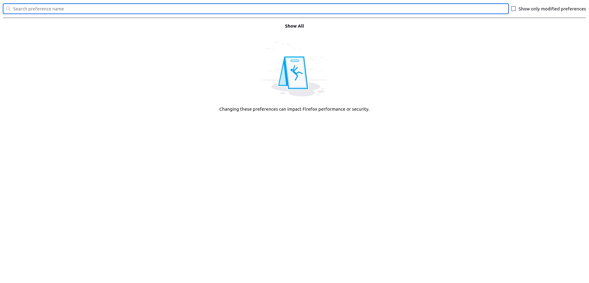
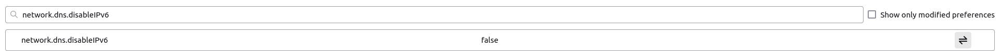
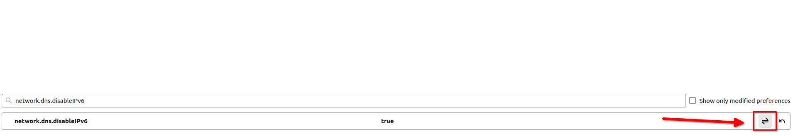
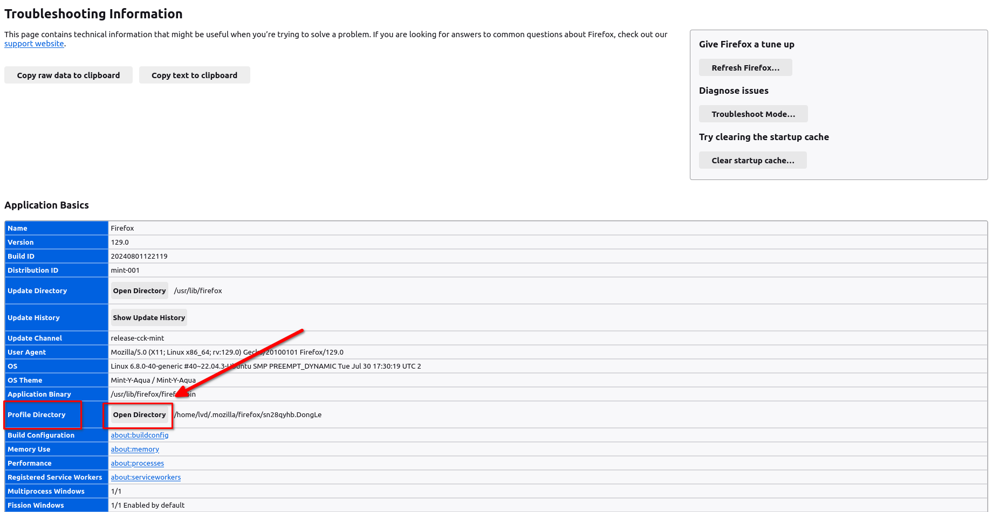
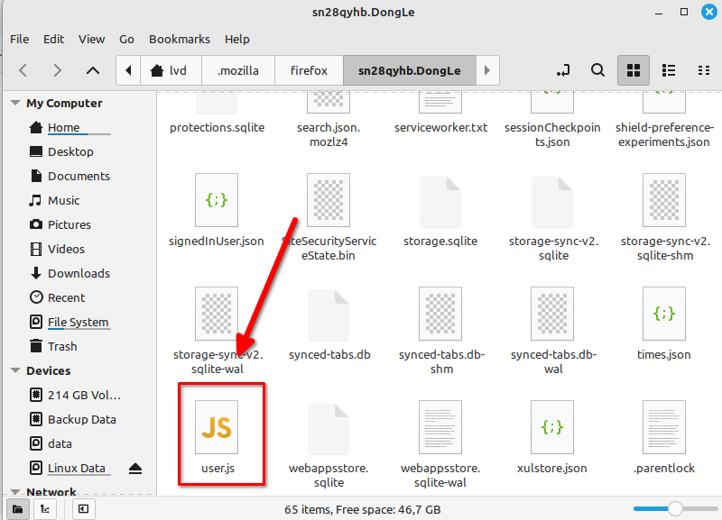
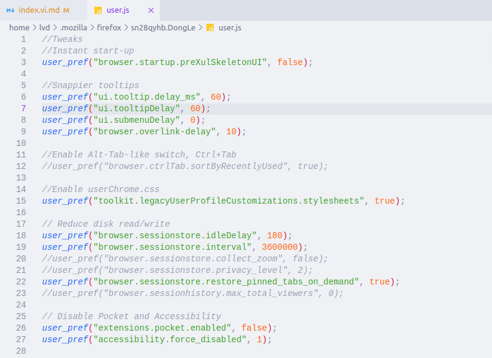
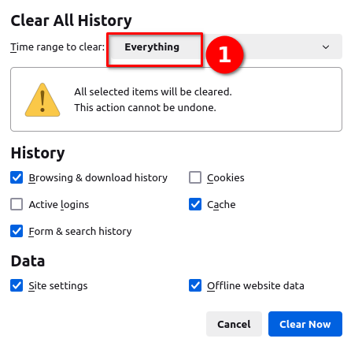
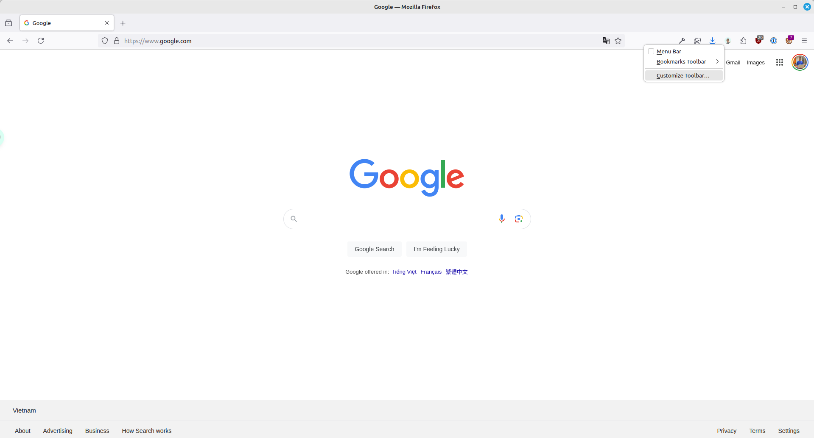
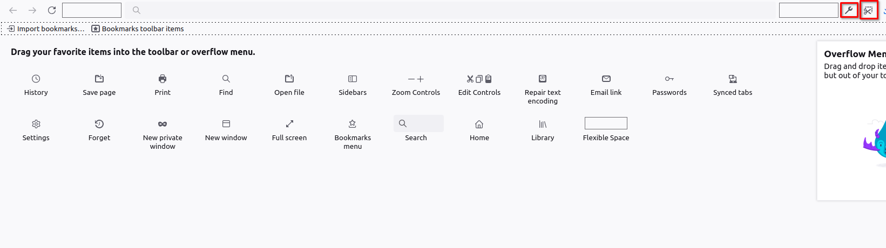

Firefox là một trình duyệt web nâng cao, để sử dụng nó bạn cần tối ưu theo cách của bạn. Nếu bạn cần một trình duyệt chỉ cần cài và dùng? Hãy chọn Chrome. Nếu bạn cần một trình duyệt đáp ứng được nhu cầu công việc, tối ưu hóa cách làm việc, tinh chỉnh cho phù hợp cá nhân thì bạn hãy chọn Firefox.


- Firefox bạn cũng có thể cài và dùng như Chrome và nếu muốn thì bạn thêm tinh chỉnh theo nhu cầu cá nhân. Tức là như Chrome và thêm tinh chỉnh cá nhân.


Có hai cách để bạn cài setting cho trình duyệt của mình. Mình khuyến khích dùng [cách 2](./#cách-thay-đổi-bằng-file-khuyến-khích-sử-dụng) để tiện cho việc backup và khôi phục.

## Cách cài đặt Setting cho trình duyệt

### Cách thay đổi trực tiếp trên trình duyệt


Khi bạn thay đổi bằng cách này, trình duyệt của bạn sẽ áp dụng khi bạn khởi động lại trình duyệt. Và những cài đặt này sẽ không thể đồng bộ với Firefox được. 

Khi bạn chuyển sang máy khác và bật `Sync` thì những gì bạn cài đặt sẽ mất. Nếu bạn muốn sao lưu và khôi phục tất cả cài đặt thì chuyển sang [Mục 2](./#c%c3%a1ch-thay-%c4%91%e1%bb%95i-b%e1%ba%b1ng-file-khuy%e1%ba%bfn-kh%c3%adch-s%e1%bb%ad-d%e1%bb%a5ng).


#### Bật config của Firefox

Các bạn nhập vào trên thanh địa chỉ là `about:config` để truy cập. Khi có thông báo cảnh báo thì chấp nhận cảnh báo để vào trang cài đặt.



#### Chỉnh sửa config

Để tinh chỉnh thì các bạn nhập các lệnh trong bài viết này vào và set giá trị theo giống như trên bài viết.


Khi mình gửi theo dạng:
- `user_pref("network.dns.disableIPv6", true);` tức là bạn sẽ search `network.dns.disableIPv6` và giá trị của nó bật lên là `true`.



**Mặc định**:


**Sau khi chỉnh sửa**:



### Cách thay đổi bằng file (Khuyến khích sử dụng)


Khi bạn thay đổi bằng cách này, trình duyệt của bạn sẽ áp dụng khi bạn tắt và khởi động lại trình duyệt. Và những cài đặt này sẽ theo như trong file `user.js` của bạn.

Khi bạn chuyển sang máy khác, bạn chỉ cần copy file `user.js` vào thư mục `profile` là được.


#### Mở thư mục Profile

Các bạn gõ `about:support`. Sau đó, click vào `Open Directory` của `Profile Directory` để mở thư mục Profile lên. Các bạn có thấy quen không? Đúng rồi, nó là cái bên bài [Backup và khôi phục Firefox](/backup-khoi-phuc-firefox/#sao-lưu) đó. Khi bạn backup thư mục này thì cũng là backup luôn file `user.js`.



#### Tạo file `user.js`

Sau đó, các bạn tạo 1 file mới là `user.js`. Cho bạn nào không biết cách tạo, thì các bạn cứ tạo file `user.txt` như bình thường, sau đó đổi đuôi thành `.js` là được.



#### Tinh chỉnh

Tiếp theo, các bạn mở file `user.js` bằng `notepad` lên và lựa chọn setting theo cách của bạn. Xem thêm [Mục 3](./#một-số-setting-tối-ưu).


Khi mình để `user_pref("network.IDN_show_punycode", true);` thì các bạn chỉ cần copy nó và paste vào file `user.js` là được.



## Một số setting tối ưu

### Cách dọn dẹp Firefox cho nhẹ hơn

Trên Firefox bạn có thể dễ dàng dọn dẹp Firefox nhẹ hơn mà không mất các login đăng nhập và sử dụng như bình thường.

```json
user_pref("privacy.sanitize.useOldClearHistoryDialog", true);
```
Sau đó, nhấn tổ hợp phím `Ctrl + Shift + Delete` để mở hộp thoại xóa rác.


Không chọn mục Cookies nhé. Vì chúng ta cần giữ lại đăng nhập mà.




### Bật chụp hình ảnh và công cụ lấy màu

Đầu tiên các bạn click chuột phải vào thanh bar của Firefox và chọn `Customize Toolbar`



Sau đó các bạn kéo hai công cụ hình cờ-lê và cây kéo vào thanh toolbar như hình bên dưới



Để lấy màu các bạn click vào hình cờ-lê và chọn `Eyedropper` để hiện công cụ lấy màu.

### Bật Punnycode chống giả mạo tên miền

Dùng để chống các tên miền giả mạo như `lêvandong.com` giả mạo của `levandong.com` thành `xn--lvandong-k1a.com`. Như vậy bạn sẽ nhận biết được tên miền giả mạo dễ hơn. [Đọc thêm](/firefox-co-gi-hay/#punnycode-giả-mạo-tên-miền)

```json
user_pref("network.IDN_show_punycode", true);
```

### Bật container không cần extension

Một container như một tab ẩn danh vậy và tab ẩn danh này lưu được mật khẩu không bị mất khi tắt trình duyệt. [Đọc thêm]((/firefox-co-gi-hay/#container)).

```json
user_pref("privacy.userContext.enabled", true);
user_pref("privacy.userContext.ui.enabled", true);
```
### Lướt các trang web bị chặn truy cập
Để lướt các trang web bị chặn các bạn cần bật ECH, Firefox bãn mới nhất hiện đang bật mặc định, các bạn chỉ cần thêm 2 khóa sau để truy cập. [Đọc thêm](/firefox-co-gi-hay/#lướt-các-trang-web-bị-chặn)
#### Bật Kyber

```json
// Enable Kyber to access blocked websites
user_pref("security.tls.enable_kyber", true);
user_pref("network.http.http3.enable_kyber", true);
```
#### Cập nhật DNS over Https (DoH)

##### Cập nhật bằng Setting của Firefox

Sau đó, các bạn vào `Setting của Firefox` → `Privacy & Security` → `Enable DNS over HTTPS using` → `Max Protection` → `NextDNS`.
Bạn có thể chọn NextDNS hoặc Cloudflare gì cũng được. Khi nào bạn không truy cập được web thì đổi thành `Cloudflare`, còn không thì dùng `NextDNS` để lướt web nhanh hơn. 

##### Cập nhật bằng file `user.js`

Nếu bạn muốn cài DoH qua file user.js thì chèn vào các dòng sau. Mặc định là sử dụng NextDNS nhé.

```json
user_pref("network.trr.mode", 3);
user_pref("network.trr.uri", "https://firefox.dns.nextdns.io/");
```

Sau đó, các bạn thử truy cập trang Medium xem được chưa nhé.

### Bật RamDisk trên Firefox
Cache là file tạm để tối ưu tốc độ khi duyệt web. Nhưng Firefox mặc định sẽ sử dụng ổ đĩa thay vì RAM để cache. RAM có tốc độ rất cao khi so sánh với Disk. Cho nên, việc lưu trữ dữ liệu trên RAM sẽ cho tốc độ duyệt web nhanh hơn. Tuy nhiên, khi lưu trữ RAM thì cache sẽ bị xóa khi bạn tắt máy và chỉ tối ưu nếu như bạn không tắt máy thường xuyên, còn Disk thì sẽ được lưu lại tối ưu nếu bạn có thói quen tắt máy sau khi sử dụng. Ngoài ra, khi sử dụng RamDisk thì sẽ hạn chế ghi vào ổ SSD sẽ giúp bạn hạn chế giảm tuổi thọ của Disk bạn đang sử dụng.

> Với người dùng không hiểu ý trên đang nói gì, thì giữ nguyên, **không** đem config này vào file `user.js`

```json
user_pref("browser.cache.disk.enable", false);
user_pref("browser.cache.memory.enable", true);
user_pref("browser.cache.memory.capacity", 524288);
user_pref("browser.cache.memory.max_entry_size", 512000);
```

## Kết luận

Với Firefox, ta có thể cài đặt nhiều thứ khá đặc biệt để đáp ứng cho nhu cầu của từng cá nhân. Ngoài ra, ta cũng có thể backup lại mọi cài đặt của Firefox và khôi phục trong vài giây.

## Tham khảo
[Tổng hợp những addon chất cho Firefox / Chromium](https://voz.vn/t/tong-hop-nhung-addon-chat-cho-firefox-chromium.682181/)