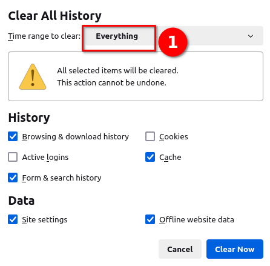
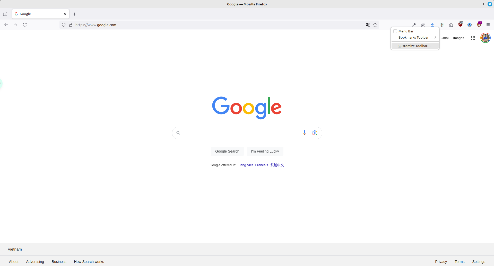
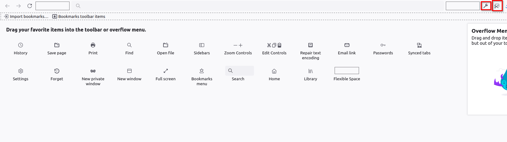
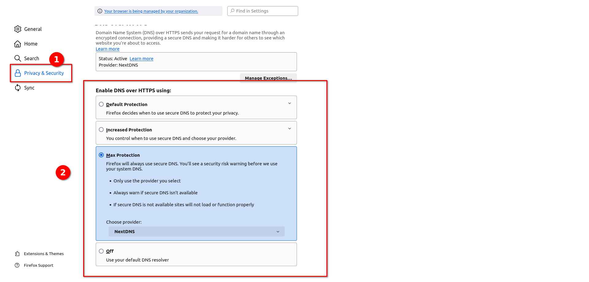
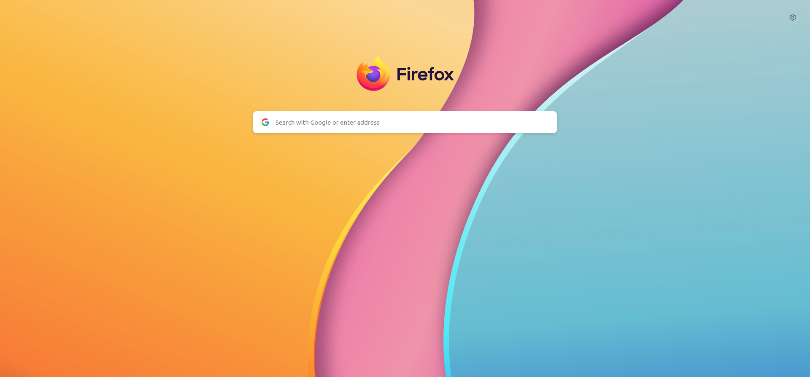

Đây là một số tối ưu dành cho Firefox. Bạn tham khảo, cân nhắc và lựa chọn những setting phù hợp cho cấu hình máy cũng như nhu cầu của các bạn. Để thiết đặt các setting thì các bạn vui lòng đọc bài [Các cách bật cài đặt cho Firefox](/cach-bat-cai-dat-cho-firefox/).

## Một số setting tối ưu

### Cách dọn dẹp Firefox cho nhẹ hơn

Trên Firefox bạn có thể dễ dàng dọn dẹp Firefox nhẹ hơn mà không mất các login đăng nhập và sử dụng như bình thường.

```javascript
user_pref("privacy.sanitize.useOldClearHistoryDialog", true);
```

Sau đó, nhấn tổ hợp phím `Ctrl + Shift + Delete` để mở hộp thoại xóa rác.


Không chọn mục Cookies nhé. Vì chúng ta cần giữ lại đăng nhập mà.




### Bật chụp hình ảnh và công cụ lấy màu

Đầu tiên các bạn click chuột phải vào thanh bar của Firefox và chọn `Customize Toolbar`



Sau đó các bạn kéo hai công cụ hình cờ-lê và cây kéo vào thanh toolbar như hình bên dưới



Để lấy màu các bạn click vào hình cờ-lê và chọn `Eyedropper` để hiện công cụ lấy màu.

### Bật Punnycode chống giả mạo tên miền

Dùng để chống các tên miền giả mạo như `lêvandong.com` giả mạo của `levandong.dev` thành `xn--lvandong-k1a.com`. Như vậy bạn sẽ nhận biết được tên miền giả mạo dễ hơn. [Đọc thêm](/firefox-co-gi-hay/#punnycode-giả-mạo-tên-miền)

```javascript
user_pref("network.IDN_show_punycode", true);
```

### Bật container không cần extension

Một container như một tab ẩn danh vậy và tab ẩn danh này lưu được mật khẩu không bị mất khi tắt trình duyệt. [Đọc thêm](<(/firefox-co-gi-hay/#container)>).

```javascript
user_pref("privacy.userContext.enabled", true);
user_pref("privacy.userContext.ui.enabled", true);
```

### Lướt các trang web bị chặn truy cập

Để lướt các trang web bị chặn các bạn cần bật ECH, Firefox bản mới nhất hiện đang bật mặc định, các bạn chỉ cần thêm 2 khóa sau để truy cập. [Đọc thêm](/firefox-co-gi-hay/#lướt-các-trang-web-bị-chặn)

#### Bật Kyber

```javascript
// Enable Kyber to access blocked websites
user_pref("security.tls.enable_kyber", true);
user_pref("network.http.http3.enable_kyber", true);
```

Tiếp theo các bạn cần bật DoH như hướng dẫn bên dưới. Có 2 cách cài đặt thông qua Setting UI và qua file `user.js`.

#### Cập nhật DNS over Https (DoH)

##### Cập nhật bằng Setting của Firefox

Sau đó, các bạn vào `Setting của Firefox → Privacy & Security → Enable DNS over HTTPS using → Max Protection → NextDNS`.
Bạn có thể chọn NextDNS hoặc Cloudflare gì cũng được. Khi nào bạn không truy cập được web thì đổi thành `Cloudflare`, còn không thì dùng `NextDNS` để lướt web nhanh hơn.



##### Cập nhật bằng file `user.js`

Nếu bạn muốn cài DoH qua file user.js thì chèn vào các dòng sau. Mặc định là sử dụng NextDNS nhé.

```javascript
user_pref("network.trr.mode", 3);
user_pref("network.trr.uri", "https://firefox.dns.nextdns.io/");
```

Sau đó, các bạn thử truy cập trang Medium xem được chưa nhé.

### Bật RamDisk trên Firefox

Cache là file tạm để tối ưu tốc độ khi duyệt web. Nhưng Firefox mặc định sẽ sử dụng ổ đĩa thay vì RAM để cache. RAM có tốc độ rất cao khi so sánh với Disk. Cho nên, việc lưu trữ dữ liệu trên RAM sẽ cho tốc độ duyệt web nhanh hơn. Tuy nhiên, khi lưu trữ RAM thì cache sẽ bị xóa khi bạn tắt máy và chỉ tối ưu nếu như bạn không tắt máy thường xuyên, còn Disk thì sẽ được lưu lại tối ưu nếu bạn có thói quen tắt máy sau khi sử dụng. Ngoài ra, khi sử dụng RamDisk thì sẽ hạn chế ghi vào ổ SSD sẽ giúp bạn hạn chế giảm tuổi thọ của Disk bạn đang sử dụng.

> Với người dùng không hiểu ý trên đang nói gì, thì giữ nguyên, **không** đem config này vào file `user.js`

```javascript
user_pref("browser.cache.disk.enable", false);
user_pref("browser.cache.memory.enable", true);
user_pref("browser.cache.memory.capacity", 524288);
user_pref("browser.cache.memory.max_entry_size", 512000);
```

### Các tối ưu của Betterfox

Đây là các setting của các người dùng Firefox chuyên sâu. Các bạn có thể yên tâm sử dụng vì nó chỉ có mục đích xóa theo dõi của Firefox, tăng cache để tăng tốc, tắt các tính năng dư thừa,...

```javascript
/****************************************************************************
 * Betterfox                                                                *
 * "Ad meliora"                                                             *
 * version: 128                                                             *
 * url: https://github.com/yokoffing/Betterfox                              *
 ****************************************************************************/

/****************************************************************************
 * SECTION: FASTFOX                                                         *
 ****************************************************************************/
/** GENERAL ***/
user_pref("content.notify.interval", 100000);

/** GFX ***/
user_pref("gfx.canvas.accelerated.cache-items", 4096);
user_pref("gfx.canvas.accelerated.cache-size", 512);
user_pref("gfx.content.skia-font-cache-size", 20);

/** MEDIA CACHE ***/
user_pref("media.memory_cache_max_size", 65536);
user_pref("media.cache_readahead_limit", 7200);
user_pref("media.cache_resume_threshold", 3600);

/** IMAGE CACHE ***/
user_pref("image.mem.decode_bytes_at_a_time", 32768);

/** NETWORK ***/
user_pref("network.http.max-connections", 1800);
user_pref("network.http.max-persistent-connections-per-server", 10);
user_pref("network.http.max-urgent-start-excessive-connections-per-host", 5);
user_pref("network.http.pacing.requests.enabled", false);
user_pref("network.dnsCacheExpiration", 3600);
user_pref("network.ssl_tokens_cache_capacity", 10240);

/** TELEMETRY ***/
user_pref("datareporting.policy.dataSubmissionEnabled", false);
user_pref("datareporting.healthreport.uploadEnabled", false);
user_pref("toolkit.telemetry.unified", false);
user_pref("toolkit.telemetry.enabled", false);
user_pref("toolkit.telemetry.server", "data:,");
user_pref("toolkit.telemetry.archive.enabled", false);
user_pref("toolkit.telemetry.newProfilePing.enabled", false);
user_pref("toolkit.telemetry.shutdownPingSender.enabled", false);
user_pref("toolkit.telemetry.updatePing.enabled", false);
user_pref("toolkit.telemetry.bhrPing.enabled", false);
user_pref("toolkit.telemetry.firstShutdownPing.enabled", false);
user_pref("toolkit.telemetry.coverage.opt-out", true);
user_pref("toolkit.coverage.opt-out", true);
user_pref("toolkit.coverage.endpoint.base", "");
user_pref("browser.newtabpage.activity-stream.feeds.telemetry", false);
user_pref("browser.newtabpage.activity-stream.telemetry", false);

/** EXPERIMENTS ***/
user_pref("app.shield.optoutstudies.enabled", false);
user_pref("app.normandy.enabled", false);
user_pref("app.normandy.api_url", "");

/** CRASH REPORTS ***/
user_pref("breakpad.reportURL", "");
user_pref("browser.tabs.crashReporting.sendReport", false);
user_pref("browser.crashReports.unsubmittedCheck.autoSubmit2", false);

/** DETECTION ***/
user_pref("captivedetect.canonicalURL", "");
user_pref("network.captive-portal-service.enabled", false);
user_pref("network.connectivity-service.enabled", false);
user_pref("dom.private-attribution.submission.enabled", false);

/****************************************************************************
 * SECTION: PESKYFOX                                                        *
 ****************************************************************************/
/** MOZILLA UI ***/
user_pref("browser.privatebrowsing.vpnpromourl", "");
user_pref("extensions.getAddons.showPane", false);
user_pref("extensions.htmlaboutaddons.recommendations.enabled", false);
user_pref("browser.discovery.enabled", false);
user_pref("browser.shell.checkDefaultBrowser", false);
user_pref(
  "browser.newtabpage.activity-stream.asrouter.userprefs.cfr.addons",
  false
);
user_pref(
  "browser.newtabpage.activity-stream.asrouter.userprefs.cfr.features",
  false
);
user_pref("browser.preferences.moreFromMozilla", false);
user_pref("browser.tabs.tabmanager.enabled", false);
user_pref("browser.aboutConfig.showWarning", false);
user_pref("browser.aboutwelcome.enabled", false);

/** THEME ADJUSTMENTS ***/
user_pref("toolkit.legacyUserProfileCustomizations.stylesheets", true);
user_pref("browser.compactmode.show", true);
user_pref("browser.display.focus_ring_on_anything", true);
user_pref("browser.display.focus_ring_style", 0);
user_pref("browser.display.focus_ring_width", 0);
user_pref("layout.css.prefers-color-scheme.content-override", 2);
user_pref("browser.privateWindowSeparation.enabled", false); // WINDOWS

/** FULLSCREEN NOTICE ***/
user_pref("full-screen-api.transition-duration.enter", "0 0");
user_pref("full-screen-api.transition-duration.leave", "0 0");
user_pref("full-screen-api.warning.delay", -1);
user_pref("full-screen-api.warning.timeout", 0);

/** URL BAR ***/
user_pref("browser.urlbar.suggest.calculator", true);
user_pref("browser.urlbar.unitConversion.enabled", true);
user_pref("browser.urlbar.trending.featureGate", false);

/** NEW TAB PAGE ***/
user_pref("browser.newtabpage.activity-stream.feeds.topsites", false);
user_pref("browser.newtabpage.activity-stream.feeds.section.topstories", false);

/** POCKET ***/
user_pref("extensions.pocket.enabled", false);

/** PDF ***/
user_pref("browser.download.open_pdf_attachments_inline", true);

/** TAB BEHAVIOR ***/
user_pref("browser.bookmarks.openInTabClosesMenu", false);
user_pref("browser.menu.showViewImageInfo", true);
user_pref("findbar.highlightAll", true);
user_pref("layout.word_select.eat_space_to_next_word", false);

/****************************************************************************
 * START: MY OVERRIDES                                                      *
 ****************************************************************************/
// visit https://github.com/yokoffing/Betterfox/wiki/Common-Overrides
// visit https://github.com/yokoffing/Betterfox/wiki/Optional-Hardening
// Enter your personal overrides below this line:

/****************************************************************************
 * SECTION: SMOOTHFOX                                                       *
 ****************************************************************************/
// visit https://github.com/yokoffing/Betterfox/blob/main/Smoothfox.js
// Enter your scrolling overrides below this line:

/****************************************************************************
 * END: BETTERFOX                                                           *
 ****************************************************************************/
```

### Bật tính năng thay đổi background của New Tab

Thêm background cho Firefox để nịnh mắt hơn.

```javascript
user_pref("browser.newtabpage.activity-stream.newtabWallpapers.enabled", true);
```



### Tắt tự động bật video của các trang web

Bạn có từng truy cập web và video tự bật lên không? Với mình nó rất ồn ào. Nên mình tắt.

```javascript
user_pref("media.autoplay.default", 5);
```

### Tắt Ipv6

Ipv6 có đôi lúc sẽ làm lộ IP của bạn khi dùng VPN hoặc đổi Ipv4. Bạn có thể bị định danh vì bật Ipv6. Để tránh việc theo dõi, bạn có thể tắt Ipv6 ở Windows. Nhưng nếu bạn chỉ muốn tắt ở Firefox thôi thì hãy sử dụng mã này.

```javascript
user_pref("network.dns.disableIPv6", true);
```

### Cuộn chuột mượt hơn - Smooth scroll

Nếu bạn dùng laptop, khi các bạn cuộn chuột bằng touch bar laptop có thể gây tình trạng khó chịu. Bạn có thể dùng mã này để cuộn mượt hơn. Còn các bạn sử dụng Desktop thì gần như không có sự khác biệt gì nhiều.

```javascript
user_pref("apz.overscroll.enabled", true);
user_pref("general.smoothScroll", true);
user_pref("mousewheel.default.delta_multiplier_y", 275);
user_pref("general.smoothScroll.mouseWheel.durationMaxMS", 250);
user_pref("general.smoothScroll.mouseWheel.durationMinMS", 200);
user_pref("mousewheel.enable_pixel_scrolling", false);
```

### Cài extension bên ngoài không thông qua Firefox Addons

Bạn muốn cài extension bên ngoài?

```javascript
user_pref("xpinstall.signatures.required", false);
user_pref("extensions.experiments.enabled", true);
```

### Download max speed

Để mở tối đa băng thông tải file.

```javascript
user_pref("network.http.http3.cc_algorithm", 0);
```

### Tối ưu bytecode

Tối ưu bytecode và lúc nào cũng nén bytecode

```javascript
user_pref("browser.cache.jsbc_compression_level", 2);
user_pref("dom.script_loader.bytecode_cache.strategy", -1);
```

### Tối ưu javascript

Dùng để tối ưu javascript. Riêng `javascript.options.mem.gc_max_parallel_marking_threads` các bạn nên chỉnh theo số luồng đang có trên cpu của bạn. Nếu không xác định được máy tính bạn có bao nhiêu luồng thì để mặc định là `4`.

```javascript
user_pref("javascript.options.experimental.shadow_realms", true);
user_pref("javascript.options.mem.gc_balanced_heap_limits", true);
user_pref("javascript.options.mem.gc_max_parallel_marking_threads", 4); // Thay đổi theo luồng đang có ở máy tính
user_pref("javascript.options.spectre.index_masking", false);
user_pref("javascript.options.spectre.object_mitigations", false);
user_pref("javascript.options.spectre.string_mitigations", false);
user_pref("javascript.options.spectre.value_masking", false);
user_pref("javascript.options.wasm_experimental_compile_pipeline", true);
```

## Một số setting từ các chuyên gia

Đây là hai nơi có user.js khá an toàn và lành tính, không làm thay đổi trải nghiệm của người dùng quá nhiều.

[FirefoxUniverse](https://github.com/FirefoxUniverse/FirefoxTweaksVN/raw/main/user.js)

[BetterFox](https://github.com/yokoffing/Betterfox)

## Kết luận

Với Firefox, ta có thể cài đặt nhiều thứ khá đặc biệt để đáp ứng cho nhu cầu của từng cá nhân. Ngoài ra, ta cũng có thể backup lại mọi cài đặt của Firefox và khôi phục trong vài giây.

## Tham khảo

[Tổng hợp những addon chất cho Firefox / Chromium](https://voz.vn/t/tong-hop-nhung-addon-chat-cho-firefox-chromium.682181/)
